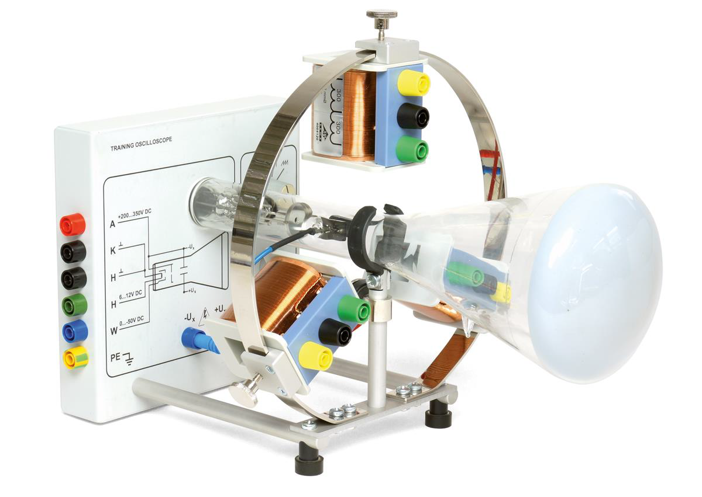
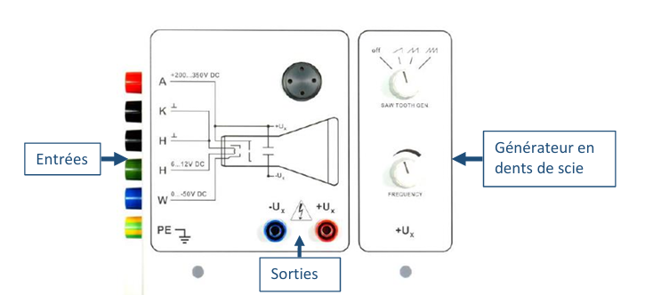
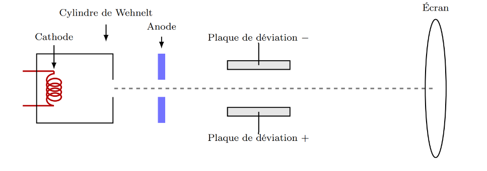
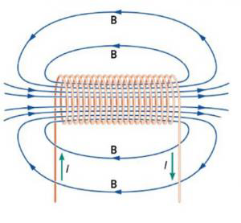
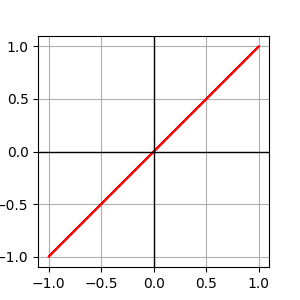

---
header-includes:
  - \usepackage[a4paper, top=2cm, bottom=2cm, left=1.5cm, right=1.5cm]{geometry}
  - \usepackage{fancyhdr}
  - \pagestyle{fancy}
  - \fancyhead[L]{Aurore Delessert \newline Magali Tornare}
  - \fancyhead[R]{Phy3-Labo 02}
  - \fancyfoot[C]{Page \thepage}
  - \usepackage{graphicx}
  - \usepackage{tikz}
  - \usepackage{pgfplots}
  - \pgfplotsset{compat=newest}
  - \usetikzlibrary{arrows.meta}
  - \usepackage{amsmath}
  - \usepackage{capt-of}
  - \usepackage{booktabs}
---

\includegraphics[width=0.25\textwidth]{images/heig-logo.png}

\thispagestyle{empty}
\begin{center}
\vspace*{3cm}

\noindent\rule{\textwidth}{0.4pt}\\[0.6cm]

{\Huge \textbf{Labo 02}}\\[0.5cm]
{\LARGE \textit{Canon à électrons}}\\[0.3cm]
\noindent\rule{\textwidth}{0.4pt}\\[1.5cm]

{\Large \textbf{Aurore Delessert, Magali Tornare}}\\
Physique — HEIG-VD\\[1.5cm]

\textbf{Date du laboratoire :} 17 octobre 2025\\
\textbf{Professeure :} Dr Anne-Gabrielle Pawlowski\\
\textbf{Salle de classe :} T06\\[3cm]

\vfill
\end{center}

\clearpage
\setcounter{page}{1}

\tableofcontents

\newpage

## Introduction

Des faisceaux d’électrons sont aujourd’hui beaucoup utilisés industriellement, par exemple pour la gravure de microstructures pour la microélectronique ou pour le soudage ou l’impression 3D par faisceau d’électrons. Ces applications sont récentes, d’autres exemples plus traditionnels d’application de faisceaux à électrons se trouvent dans des sources à rayons X pour l’imagerie médicale ou dans des microscopes électroniques pour l’analyse de matériaux, mais aussi dans des oscilloscopes ou télévisions traditionnelles qui utilisent des faisceaux d’électrons pour l’affichage d’un signal électrique ou d’une image.

Ces instruments et applications se basent sur la déviation d’un faisceau d’électrons dans des champs électriques et magnétiques. Ces systèmes contiennent donc un canon à électrons (tube cathodique) pour générer le faisceau d’électrons et utilisent des champs électriques et magnétiques pour le dévier.

Le système d’expérimentation “oscilloscope didactique” du laboratoire PHY3 permet d’étudier la déviation d’un faisceau d’électrons par des champs électriques et magnétiques. De plus, un balayage contrôlé du faisceau à l’aide de signaux périodiques peut être étudié, ainsi que la représentation à résolution temporelle de signaux électriques sur un écran fluorescent, telle que réalisée dans des oscilloscopes traditionnels.
Le faisceau est généré et focalisé sous vide dans un tube cathodique (dit aussi tube de Braun). Le point d’impact des électrons peut être observé sur un écran fluorescent sous la forme d’une tâche lumineuse verte.

- Afin d’observer également le tracé de la trajectoire du faisceau, on peut obscurcir le système, par exemple à l’aide d’un grand carton. La trajectoire du faisceau des électrons est visible grâce à l’ionisation d’un gaz résiduel (ici néon) par lequel le tube à vide avait été rempli à faible pression (les électrons qui entrent en collision avec des molécules du gaz, les excitent et on observe ensuite la lumière qui est émise par les atomes du gaz).
- Un champ électrique axiale appliqué à l’intérieure de la partie tube cathodique (entre la cathode et l’anode) permet l’accélération des électrons qui sont libérés par la cathode (chauffée à l’aide d’un filament) et ainsi de régler la vitesse des électrons.
- Un champ électrique latérale et orienté horizontalement (entre deux plaques d’un condensateur à plaques parallèles) permet une déviation et balayage horizontal du faisceau, à l’aide d’une tension à dents de scie (le faisceau d’électrons se déplace ainsi à vitesse constante de gauche à droite pour revenir d’un saut à son point d’origine ; le processus se répète de manière périodique avec une fréquence réglable).
- Des champs magnétiques, orientés perpendiculairement par rapport au faisceau d’électrons, peuvent également dévier le faisceau. Pour générer les champs magnétiques des bobines électriques sont utilisées et peuvent être placées sous différents angles à l’extérieur du tube à vide, sur une armature circulaire et concentrique autour de l’axe du tube cathodique, afin d’étudier la déviation du faisceau de manière contrôlée en fonction de l’alimentation des bobines et de la vitesse des électrons.
Lorsque l’on choisit l’emplacement d’une bobine telle que la déviation du faisceau d’électrons par le champ magnétique résulte le long l’axe verticale, on peut alimenter la bobine avec un signal électrique que l’on souhaite représenter en fonction du temps, simultanément à un balayage horizontal du faisceau, et ainsi rendre visible le signal électrique sur l’écran fluorescent comme sur un oscilloscope.

## Matériel utilisé & Caractéristiques techniques

Tout au long de notre laboratoire, nous allons utiliser le matériel suivant :

\begin{itemize}
\item Le canon à électron montré en figure 1
\item Un écran fluorescent affichant à l'aide d'un point vert l'endroit de l'impact du faisceau à électron.
\item 2 Multimètres qui nous serviront à mesurer la tension et le courant dans le montage.
\item 3 Bobines
\item Une alimentation spécifique pour le laboratoire.
\end{itemize}

Pour parler un peu plus en détails des caractéristiques techniques à prendre en compte :

\begin{itemize}
\item Une tension anodique ($V_a$) que nous devions choisir entre 200 et 350 Vcc. Nous avons pris 250 $\pm$ 2 Vcc.
\item Un courant anodique de maximum 1 mA.
\item une tension de chauffage entre 6 et 12 V
\item Une tension en dents de scie de 100 V avec une fréquence entre 3,5 et 650 Hz.
\item Des bobines de déviation qui ont soit 300 ou 600 spires, avec une résistance interne de 4,2 $\Omega$ et impédance de 6 mH.
\end{itemize}

Pour le module de commande, le voici :

Avec:
\begin{itemize}
\item A : Anode
\item C : Cathode
\item H : Chauffage
\item W : Cylindre Wehnelt
\item PE : Terre de protection
\item $U_+$ : Electrode de déviation droite
\item $U_-$ : Electrode de déviation gauche
\end{itemize}

\newpage

## Prise en main & Calibration du système

Afin de pouvoir réaliser ce laboratoire avec une meilleur visibilité des mesures, nous avons :
\begin{itemize}
\item Fixer une tension anodique à 250V
\item Comme la tension de chauffage n'impacte pas la manipulation actuelle, nous l'avons mise au maximum, soit 8V.
\item Pour pouvoir trouver la meilleure position du point sur l'oscilloscope didactique (c'est-à-dire au maximum au centre), nous avons orienté / tourné les 2 petits aimants qui se situaient sous l'écran comme montré sur la photo ci-dessous.
\item Dans le but de pouvoir mieux comprendre comment régler le système et de réaliser des mesures précises et plus simple à analyser, nous avons calibré notre oscilloscope en déterminant la tension de Wehnelt.

En testant différentes tension de Wehnelt, nous avons trouvé que la meilleure tension pour pouvoir bien visualiser le point est de -18 $\pm$ 0,2V.
\end{itemize}

{width=300px}

\newpage
  
## 1 Manipulation 1 - Déviation électrique du faisceau électronique

### 1.1 Rappels théoriques

#### La génération des électrons

Les électrons sont produits par **une émission themoïonique** à partir d'une cathode chauffée.
"Une émission thermoïonique (ou émission thermoélectronique) est un flux d'électrons provenant d'un métal ou d'un oxyde métallique, qui est provoqué par les vibrations des atomes dues à l'énergie thermique lorsque ceux-ci parviennent à surmonter les forces électrostatiques." (source : Wikipedia)
Le chauffage diminue la barrière de potentiel et permet aux électrons de s'échapper de la surface. Un **cylindre de Wehnelt**, polarisé de quelques dizaines de volts encore plus négativement que la cathode, repousse les électrons émis hors axe et les focalise en faisant un point de croissement sur l'axe. Une **anode** est placée à environ 10mm plus loin, portée à une tension positive par rapport à la cathode, attire et accélère les électrons à travers l'ouverture centrale.

#### Le rôle des plaques de déviation
  
Le tube est équipé de 2 plaques de déviation électrostatiques. Cette paire de plaques latérale génère un champ électrique transverse $\vec{E}$, qui exercce sur les électrons une force $\vec{F} = q \cdot \vec{E}$. Cette force change la direction du faisceau perpendiculairement à son axe. Pour réaliser cette déviation latérale (droite ou gauche) les plaques sont polarisée de manière différentielle (+V ou -V) ce qui permet de modifier la trajectoire du faisceau sans toucher à son énergie. Contrairement à la déviation magnétique $\vec{F} = q \, \vec{v} \times \vec{E}$, qui sera étudié par la suite, la déviation électrostatique agit directement dans la direction du champ imposé entre les plaques.

Pour calculer la déviation, nous allons partir de l'hypothèse que les électrons ne sont pas *relativistes*, c'est-à-dire que leur vitesse est suffisamment faible pour que les effets de relativité soient négligeable. Nous allons donc utiliser la mécanique classique. Nous démontrerons plus bas que comme la vitesse des électrons est très loins de la vitesse de la lumière, les effets relativistes (comme l'augmentation de la masse effective) sont négligeables.

#### Notations

{width=400px}

$\begin{cases} V_a = \text{tension d'accélération (anode-cathode)} [V] \\ V_p = \text{tension appliquée aux plaques de déviation} [V] \\ d = \text{distance entre les plaques} [m] \\ l = \text{longueur des plaques} [m] \\ L = \text{distance entre la sortie des plaques et l'écran} [m] \end{cases}$

#### Vitesse des électrons  
  
On sait que : $E_c = \dfrac{1}{2} m_e v^2 = e V_a$.

Alors on peut facilement trouver la vitesse de l'électron qui donne : $v_e = \sqrt{\dfrac{2 e V_a}{m_e}}$ (1)

#### Déviation horizontale du faisceau

Avec les notations du schéma, on peut calculer la déviation horizontale $D$ du faisceau sur l'écran.

La force exercée sur l'électron dans la région des plaques est : $F = q E = q \dfrac{V_p}{d}$(2)

L'accélération subie par l'électron dans cette région est donc : $a = \dfrac{F}{m_e} = \dfrac{q V_p}{m_e d}$(3)

Le temps passé par l'électron dans la région des plaques est : $t_1 = \dfrac{l}{v_e}$(4)

La vitesse acquise dans la direction horizontale à la sortie des plaques est donc : $v_x = a t_1 = \dfrac{q V_p}{m_e d} \cdot \dfrac{l}{v_e}$(5)
Après la sortie des plaques, l'électron continue son mouvement avec une vitesse horizontale constante $v_x$ pendant un temps $t_2 = \dfrac{L}{v_e}$ avant d'atteindre l'écran. La déviation horizontale $D$ sur l'écran est donc : $D = v_x t_2 = \left( \dfrac{q V_p}{m_e d} \cdot \dfrac{l}{v_e} \right) \cdot \dfrac{L}{v_e}$(6)

En remplaçant $v_e$ par son expression (1), on obtient finalement :

$$D = \dfrac{q V_p l L}{m_e d \left( \dfrac{2 q V_a}{m_e} \right)} = \dfrac{V_p l L}{2 d V_a}\text{ }(7)$$

#### Incertitudes sur la déviation

La déviation $D$ dépend linéairement de $V_p$, $l$, $L$ et inversement de $d$ et $V_a$. En utilisant la formule de propagation des incertitudes pour une fonction de plusieurs variables, on trouve que l'incertitude relative sur $D$ est donnée par :

$$\dfrac{\Delta D}{D} = \dfrac{\Delta V_p}{V_p} + \dfrac{\Delta l}{l} + \dfrac{\Delta L}{L} + \dfrac{\Delta d}{d} + \dfrac{\Delta V_a}{V_a}\text{ }(8)$$

#### Application numérique

Avec les valeurs suivantes :
\begin{itemize}
\item $V_a = 250 \pm 2 V$
\item $V_p = 100 \pm 1 V$
\item $l = 0.02 \pm 0.001 m$
\item $L = 0.178 \pm 0.001 m$
\item $d = 0.014 \pm 0.001 m$
\end{itemize}

On peut calculer la déviation $D$ (7) et son incertitude $\Delta D$ (8).

$$D = \dfrac{100 \cdot 0.02 \cdot 0.178}{2 \cdot 0.014 \cdot 250} = 0.05085 m = 50.85 mm$$

$$\dfrac{\Delta D}{D} = \dfrac{1}{100} + \dfrac{0.001}{0.02} + \dfrac{0.001}{0.178} + \dfrac{0.001}{0.014} + \dfrac{2}{250} = 0.141$$

$$\Delta D = 0.141 \cdot 50.85 mm = 7.17 mm$$
Donc, la déviation du faisceau est $D = 50.85 \pm 7.17 mm$.

#### Analyses des résultats

Lorsque nous appliquons une tension de 100V aux plaques de déviation, nous observons une déviation du faisceau d'environ $55 mm$ sur l'écran, ce qui est en accord avec notre calcul théorique de $50.85 \pm 7.17 mm$. Cette concordance entre la théorie et l'expérience confirme la validité de notre modèle pour la déviation électrostatique des électrons dans le canon à électrons. Pour expliquer les petites différences entre la valeur théorique et expérimentale, nous pouvons considérer des facteurs tels que les imprécisions dans les mesures des dimensions du système, les variations de la tension appliquée, des effets non idéaux dans le tube cathodique et aussi que l'écran ou on a mesuré et incurvé.

\newpage

## 2 Manipulation 2 - Déviation magnétique du faisceau électronique

### 2.1 Introduction

### Rappel Théorique "Déviation des électrons"

La déviation magnétique d'un faisceau d'électrons permet d'étudier l'effet d'un champ magnétique sur des charges qui se déplacent. Quand on faisceau d'électrons se déplace dans un champ magnétique $\vec{B}$ qui est perpendiculaire à sa vitesse $\vec{v}$, ce dernier subit une force de Lorentz qui est donnée par la formule :  
$$\vec{F} = q(\vec{E} + \vec{v} \times \vec{B}) [N]$$  
dans laquelle q est la charge d'un électron. Cette fameuse force, qui est perpendiculaire à la direction du déplacement, provoque une trajectoire circulaire dont le rayon R peut être déterminé par l'équilibre entre la force centripète et la force magnétique, l'égalité donne :  
$$\frac{mv^2}{R} = qvB \quad \Rightarrow \quad R = \frac{mv}{qB} (20)$$  
avec : $\begin{cases} m = \text{masse de la particule} [kg] \\ v = \text{vitesse} [m/s] \\ R = \text{rayon} [m] \\ q = \text{charge de la particule} [C] \\ B = \text{champ électrique} [V/m]\end{cases}$

En utilisant la formule de l'énergie, on peut relier la vitesse de l'électron à la tension anodique V_a par :  
$$ \frac{1}{2}mv^{2} = q V_a \quad \Rightarrow \quad v = \sqrt{\frac{2qV_a}{m}} (21)$$
avec : $\begin{cases} m = \text{masse de la particule} [kg] \\ v = \text{vitesse} [m/s] \\ q = \text{charge de la particule} [C] \\ V_a = \text{tension anodique} [V]\end{cases}$

Maintenant, si on veut trouver le rayon de courbure, il faut prendre l'équation (21) et la mettre dans l'équation (20) ce qui nous donne :  
$$R = \frac{m}{qB} \cdot \sqrt{\frac{2qV_a}{m}} =\boxed{\frac{1}{B} \sqrt{\frac{2mV_a}{q}}} (22) $$
avec : $\begin{cases} m = \text{masse de la particule} [kg] \\ R = \text{rayon de courbure} [m] \\ q = \text{charge de la particule} [C] \\ B = \text{champ électrique} [V/m] \\ V_a = \text{tension anodique} [V] \end{cases}$

Nous remarquons donc que la déviation observée sur l'écran dépend du champ magnétique appliqué, de la tension d'accélération des électrons et également de la position et de l'orientation de la bobine. Cela veut donc dire que si le courant change de sens dans la bobine ou si nous déplaçons cette dernière, la déviation sera modifiée.

\newpage

### Rappel Théorique "Solénoïdes"

UN solénoïdes est en réalité une bobine de fil conducteur entroulé de manière hélicoïdale. Quand on courant électrique le parcourt, il génère un champ magnétique qui sera principalement axial à l'intérieur des spires.

#### Champ magnétique dans un solénoïde  

Le champ magnétique qui est généré par le passage d'un courant I dans une bobine ou un solénoïde dépend de la géométrie de ce dernier. S'il a une longueur infinire, le champ est considéré comme "uniforme" à l'interieur et à peu près nul à l'extérieur. Il est exprimé avec la formule suivante :
$$B = \dfrac{{\mu}_{0} N I}{L} [T](23)$$
avec : $\begin{cases} N = \text{Nombre total de spires} [-] \\ \mu_0 = \text{Perméabilité du vide} [V\cdot s /m \cdot A] \\ I = \text{Intensité du courant} [A] \\ L = \text{Longueur du solénoïde} [m] \end{cases}$

Si la solénoïde est de longueur finie, il faudra prendre en compte les effets de bords (les variations du champ près des extrémités du solénoïdes, plus précisement l'endroit où il n'est plus uniforme).

La formule pour le champ magnétique devient :
$$B = \dfrac{{\mu}_{0} N I}{\sqrt{4R^{2} + L^{2}}} [T](24)$$

avec : $\begin{cases} N = \text{Nombre total de spires} [-] \\ \mu_0 = \text{Perméabilité du vide} [V\cdot s /m \cdot A] \\ I = \text{Intensité du courant} [A] \\ L = \text{Longueur du solénoïde} \\ R = \text{Rayaon du solénoïde} [m] \end{cases}$

\newpage

Pour illustrer ce cas, voici un schéma :

{width=300px}

Si nous sommes à l'extérieur de la bobine, nous allons utiliser la formule suivant pour calculer le champ :

$$ B = \dfrac{{\mu}_{0} N I}{2L} \cdot (cos(\alpha_{1}) - cos(\alpha_{2})) [T](25) $$

Nous pouvons calculer les 2 angles à l'aide de la trigonométrie tel que :  
$$
\alpha_{1} = \arctan\left(\frac{R}{x + \frac{L}{2}}\right)
$$

$$
\alpha_{2} = \arctan\left(\frac{R}{x + L}\right)
$$

avec : $\begin{cases} N = \text{Nombre total de spires} [-] \\ \mu_0 = \text{Perméabilité du vide} [V\cdot s \cdot /m \cdot A] \\ I = \text{Intensité du courant} [A] \\ L = \text{Longueur du solénoïde}  \\ \alpha_{1}, \alpha_{2}  = \text{2 anlges (voir schéma ci-dessus) [rad] } \end{cases}$

Voici le schéma :

{width=300px}

\newpage

Information sur le champ maximal : Nous savons qu'il est maximal lorsqu'il est au centre des spires. Nous pouvons le confirmer regardant l'image si-dessous dans laquelle nous voyons un champ magnétique B généré par un courant I. Sur l'image ci-dessous, la longueur de la bobine est noté d alors que nous l'avons appelée L dans les calculs.

{width=300px}

\newpage

### Calculs des incertitudes

Nour allons réaliser les incertitudes pour la formule : $R = \frac{1}{B} \sqrt{\frac{2mV_a}{q}}$  
Incertitude relative :
$$
\left(\frac{\Delta R}{R}\right)^2
=
\left(\frac{\Delta B}{B}\right)^2
+
\frac{1}{4}\left[
\left(\frac{\Delta m}{m}\right)^2
+
\left(\frac{\Delta V_a}{V_a}\right)^2
+
\left(\frac{\Delta q}{q}\right)^2
\right]
$$

La formule simplifiée et finale donne
$$
\Delta R
=
R \cdot
\sqrt{
\left(\frac{\Delta B}{B}\right)^2
+
\frac{1}{4}\left[
\left(\frac{\Delta m}{m}\right)^2
+
\left(\frac{\Delta V_a}{V_a}\right)^2
+
\left(\frac{\Delta q}{q}\right)^2
\right]
}
$$

Nous allons réaliser les incertitudes par rapport à la formule : $B = \dfrac{{\mu}_{0} N I}{\sqrt{4R^{2} + L^{2}}} [T](24)$
$$
\left( \frac{\Delta B}{B} \right)^2 = \left( \frac{\Delta I}{I} \right)^2 + \left( \frac{R \cdot \Delta R + l \cdot \Delta l}{R^2 + l^2} \right)^2
$$

La formule simplifiée et finale donne
$$
\Delta B = B \cdot \sqrt{ \left( \frac{\Delta I}{I} \right)^2 + \left( \frac{R \cdot \Delta R + l \cdot \Delta l}{R^2 + l^2} \right)^2 }
$$

Maintenant, les incertitudes pour la formule : $B = \dfrac{{\mu}_{0} N I}{2L} \cdot (cos(\alpha_{1}) - cos(\alpha_{2})) [T](25)$

On commence avec les angles:
$$
\Delta \alpha_{1} = \sqrt{
\left(\frac{ \Delta R }{(x+\tfrac{L}{2})(1+u_1^2)}\right)^2
+
\left(\frac{ R\,\Delta x }{(x+\tfrac{L}{2})^2(1+u_1^2)}\right)^2
+
\left(\frac{ R\,\Delta L }{2\,(x+\tfrac{L}{2})^2(1+u_1^2)}\right)^2
}
\quad \text{avec } u_1=\frac{R}{x+\tfrac{L}{2}}
$$

$$
\Delta \alpha_{2} = \sqrt{
\left(\frac{ \Delta R }{(x+L)(1+u_2^2)}\right)^2
+
\left(\frac{ R\,\Delta x }{(x+L)^2(1+u_2^2)}\right)^2
+
\left(\frac{ R\,\Delta L }{(x+L)^2(1+u_2^2)}\right)^2
}
\quad \text{avec } u_2=\frac{R}{x+L}
$$

Avec les valeurs des incertitudes sur les angles, nous pouvons passer à la formule suivante, voici la formule l'incertitude relative :

$$
\left( \frac{\Delta B}{B} \right)^2 =
\left( \frac{\Delta I}{I} \right)^2 +
\left( \frac{\Delta L}{L} \right)^2 +
\left(
\frac{
\sin(\alpha_1)\,\Delta \alpha_1 +
\sin(\alpha_2)\,\Delta \alpha_2
}{
\cos(\alpha_1) - \cos(\alpha_2)
}
\right)^2
$$

et voici l'incertitude absolue:

$$
\Delta B = B \cdot \sqrt{
\left( \frac{\Delta I}{I} \right)^2 +
\left( \frac{\Delta L}{L} \right)^2 +
\left(
\frac{
\sin(\alpha_1)\,\Delta \alpha_1 +
\sin(\alpha_2)\,\Delta \alpha_2
}{
\cos(\alpha_1) - \cos(\alpha_2)
}
\right)^2
}
$$

\newpage

### Mesure et résultats

Pour commencer, nous avons décider de vérifier la polarisation du champ d'une bobine suivant la polarisation du courant avec une boussole. Nous en avons déduit que le pôle Nord est attiré par le $V_{CC}$ et donc que le pôle Sud est attiré par le GDN.Le champ $\vec{B}$ se déplace donc du $V_{CC}$ au GND.

Concernant les résultats suivant, les incertitudes des mesures de u et i sont repectivement de $\pm$ 0,005 [V] et $\pm$ 0,003 [A]. Ces dernières ont été déterminées en analysant quel digit du multimètre n'était pas stable et en regardant de combien ce dernier variait.
Afin d'éviter de ralonger le rapport, nous avons réalisé les calculs avec les valeurs mesurées et juste reporté les valeurs trouvées.

#### Mesure 1e sens

Nous avons décidé de faire 2 calques différents. Le premier avec un premier sens du courant et le 2e dans l'autre sens. Cela nous a permis de mieux comprendre et mieux voir le changement de direction. Pour ce 1e sens, le courant va de la borne jaune pour 600 spires ou noire pour 300 spires à la borne verte.
Ce que nous pouvons ajouté comme remarque visuelle est que dans chaque cas, les points partent dans une autre direction en s'éloignant du centre de l'écran.

Afin de mieux comprendre comment nous avons fait les mesures, nous avons inscrit les différentes positions de la bobine utilisée (a, b, c) ainsi que sur le calque, pour savoir quel tracé correspond à quelle position de la bobine.
Voici les valeurs que nous avons obtenues pendant cette mesure :

{width=300px}
{width=300px}

\newpage

{width=300px}

Dans les tableaux, nous remarquons que les valeurs obtenues sont linéaires, ce qui est rassurant.

Pour mieux comprendre la trajectoire du faisceau, voici un croquis qui met en lumière les différents vecteurs utilisés :

Cette trajectoire n'est pas droite car le fait de soumettre un champ magnétique (ou électrique) dévie les électrons de leur trajectoire initiale.

\newpage

#### Mesure 2e sens

Pour le 2e sens, le courant va de la borne verte à la borne verte à la borne jaune pour 600 spires ou noire pour 300 spires. Comme remarqué pour le 1e sens, les points partent toujours dans une autre direction en s'éloignant du centre de l'écran.

Afin de mieux comprendre comment nous avons fait les mesures, nous avons inscrit les différentes positions de la bobine utilisée (a, b, c) ainsi que sur le calque, pour savoir quel tracé correspond à quelle position de la bobine.
Voici les valeurs que nous avons obtenues pendant cette mesure :

{width=300px}
{width=300px}

{width=300px}

Dans les tableaux, nous remarquons que les valeurs obtenues sont linéaires, ce qui est rassurant.

Pour mieux comprendre la trajectoire du faisceau, voici un croquis qui met en lumière les différents vecteurs utilisés :

\newpage

#### Analyse numérique des résultats

Pour commencer les analyses numériques, voici les différentes valeurs du champs que nous avons mesuré :
Nous nous sommes rendues compte que les valeurs de tension sont totalement fausses car nous devions avoir la tension $V_a$ et nous avons la tension aux bornes de la bobine.

| Mesure | Tension | Courant | Champ magnétique | Nombre de spires | Position capteur |
|:------:|:-------:|:-------:|:----------------:|:----------------:|:----------------:|
|   1    |  2,184  |  0,649  | 155,4 $\mu$ T    |       300        |  hors bobine     |
|   2    |  2,344  |  1.103  | 166,4 $\mu$ T    |       600        |  hors bobine     |
|   3    |  2,441  |  0,020  | 247,0 $\mu$ T    |       600        |  centre bobine   |

Pour les différentes mesures, voici ce que nous trouvons si nous calculons le champ magnétique avec les incertitudes:

| Mesure | Champ magnétique | $\Delta B$  |
|:------:|:----------------:|:-----------:|
|   1    |   153,9 $\mu$ T  | 9,81 $\mu$ T|
|   2    |   164,2 $\mu$ T  | 6,68 $\mu$ T|
|   3    |   245,6 $\mu$ T  | 7,88 $\mu$ T|

Pour les résultats des calculs du rayon de courbure, si nous prenons les valeurs constantes :
$\begin{cases}
m = 9.109 \times 10^{-31}\ \text{kg} \\
q = 1.602 \times 10^{-19}\ \text{C}
\end{cases}$
comme nous n'avons pas mesuré la bonne tension, nous avons mis de manière arbitraire $V_a$ = 250 V.
Nous trouvons :

| Mesure | Tension | Champ magnétique | Position capteur |   Rayon de courbure   | $\Delta R$ |
|:------:|:-------:|:----------------:|:----------------:|:---------------------:|:----------:|
|   1    |  250    | 155,4 $\mu$ T    |  hors bobine     | 0,343 [m] = 34,3 [cm] |  9,3 [cm]  |
|   2    |  250    | 166,4 $\mu$ T    |  hors bobine     | 0,324 [m] = 32,4 [cm] |  9,7 [cm]  |
|   3    |  250    | 247,0 $\mu$ T    |  centre bobine   | 0,218 [m] = 21,8 [cm] |  11,1 [cm] |

\newpage

## Représentation oscilloscopique

### Théorie

L'oscilloscope à rayons cathodiques nous permet d'observer l'évolution d'un signal électrique au fil du temps en le convertissant en un mouvement lumineux sur un écran fluorescent. Le signal d'entrée est premièrement amplifié puis transmis à un système de déviation qui agit sur le faisceau d'électrons émi par le canon électronique. Quand ce faisceau arrive à l'écran, il génère un point lumineux dont la position dépend principalement des tension de déviation appliquées.

Il y a deux type de déviations :

1. **Déviation horizontale** : Les 2 plaques reçoivent une tension en dents de scie, qui augmente de manière linéaire avec le temps. Cela crée un champ électrique constant qui permet au faisceau de se déplacer de gauche à droite. Quand la tension diminue d'un coup, le faisceau revient très rapidement à gauche. Ce mouvement représente le déroulement du temps.
2. **Déviation verticale** : C'est une bobine qui est parcourue par le signal à analyser qui génère un champ magnétique variable, qui fait monter ou descendre le faisceau suivant la polarité du signal. Ce déplacement vertical correspond normalement à la valeur instantanée de la tension mesurée.

Si on combine les 2 déviations, cela nous permet de visualiser un signal en fonction du temps. Si les 2 déviations sont correctement synchronisées, l'image est stable. Dans le cas contraire, le signal peut donner l'impression se déplacer de manière horizontale sur l'écran.

### Résultat

Nous avons pris plusieurs photos à plusieurs fréquences, les voici :

Pour cette première mesure, nous avons pris une tension de 100 Hz $\pm$ 2 Hz.

{width=300px}

Pour cette deuxième mesure, nous avons pris une tension de 1000 Hz $\pm$ 2 Hz.

{width=300px}

\newpage

### Analyse

Lorsque la fréquencde de la tension en dents de scie et celle du générateur de fonctions sont synchronisée, l'scoilloscope affiche un signal stable. Ce signal résulte de l'action combinée de 2 tensions sur le faisceau d'électrons :

1. La tension en dents de scie crée un champ électrique entre les 2 plaques de déviations qui sont horizontales, ce qui déplace le faisceau de gauche à droite. Quand la tension chute, le champ s'inverse et le faisceau revient rapidement à gauche et ne bouge presque plus du tout. Ce mouvement représente le déroulement du temps.
2. En même temps, la tension sinusoïdale appliquée à une bobine génère un champ magnétique variable qui dévie le faisceau verticalement, en suivant la tension instantanée du signal.

La trajectoire du faisceau sur l'écran reflète donc bel et bien la variation du signal sinusoïdal pendant le temps.

Losque la fréquence du signal augmente progressivement (100 Hz, 250 Hz, 500 Hz, 750 Hz) le nombre de périodes visibles sur l'écran augmente aussi (1, 3, 5, 7 ou même 8).

Ce que nous remarquons aussi, c'est que à 100 Hz et 500 Hz, l'image est **stable** car les fréquences sont bien synchronisées.
Alors que à 250 Hz ou 750 Hz, l'image est instable et donne l'impression de se déplcaer horizontalement. Cette instabilité provient du manque de synchronisation entre le balayage horizontal et le signal d'entrée, surtout quand le rapport entre les 2 fréquences n'est pas un nombre entier.

### Conclusion

L'ôscillation à rayons cathodques est un instrument indispensable pour pour visualiser l'écolution dans le temps d'un signal électrique. Il repose sur la déviation d'un faisceau d'électrons, qui est influencé par 2 tension distinctes :

1. Tension en dents de scie - Assure le balayage horizontal qui représente le déroulement du temps.
2. Tension du signal à mesurer (Souvent un sinus) - Provoque une déviation verticale qui traduit la valeur instantanée de la tension.

Quand les 2 tensions sont combinées, cela permet de tracer le signal en fonciton du temps sur l'écran fluorescent.

Les observations expérimentales montrent que :

- Quand les fréquences du balayage horizontales et du signal sont synchronisée, alors l'image sur l'écran est stable.
- Si les 2 fréquences ne sont pas synchronisées alors le signal devient instables et semble se déplacer de la gauche vers la droite sur l'écran.
- Si la fréquence du signal augmente, cela entraine une augmentation du nombre de périodes visible sur l'écran. C'est ce phénomène qui permet de faire une estimation de la fréquence relative entre 2 signaux.

Les images ci-dessus illustrent bien ce phénomène. Plus il y a de cycles affichés, plus la fréquence est élevée. Ainsi, l'analyse visuelle devient un outil rapide et efficace pour comparer les fréquences de signaux.

\newpage

## 3. Formes de lissajous

### 3.1 Introduction

Les formes de Lissajous tiennent leurs noms du physicien Jules Antoine Lissajous. Il a étudié les mouvements vibratoires et a découvert que lorsque deux mouvements sinusoïdaux sont combinés, ils peuvent créer des figures géométriques complexes. Ces figures sont obtenues en traçant la trajectoire en X et Y d'un point en fonction du temps, où chaque axe représente un mouvement sinusoïdal différent.

### 3.2 Équations des mouvements

Les mouvements en X et Y sont décrits par les équations suivantes :

\begin{itemize}
\item Mouvement en X : $x(t) = A_x \sin(\omega_x t + \phi_x)$
\item Mouvement en Y : $y(t) = A_y \sin(\omega_y t + \phi_y)$
\end{itemize}

Toutes les figures de Lissajous sont caractérisées par le rapport des fréquences (et donc des pulsations) $\dfrac{\omega_x}{\omega_y}$ et le déphasage entre les deux mouvements $\Delta \phi = \phi_x - \phi_y$.

La figure la plus simple est obtenue lorsque les pulsations sont égales ($\omega_x = \omega_y$) et le déphasage est nul ($\Delta \phi = 0$), ce qui donne une ligne droite diagonale.

### 3.3 Exemples de figures de Lissajous

#### 3.3.1 Variations des amplitudes

Voici quelques exemples de variation d’amplitude avec une phase et fréquence identique :  

\centering

\begin{minipage}{0.3\textwidth}
  \centering
  \includegraphics[width=\linewidth]{images/lissajous_2.png}
  \captionof{figure}{Amplitude de Y plus grande que celle de X}
\end{minipage}
\hfill
\begin{minipage}{0.3\textwidth}
  \centering
  \includegraphics[width=\linewidth]{images/lissajous_3.png}
  \captionof{figure}{Amplitude de X plus grande que celle de Y}
\end{minipage}
\raggedright

#### 3.3.2 Variations du déphasage

Voici quelques exemples de variation de déphasage avec des amplitudes et fréquences identiques :  

\centering

\begin{minipage}{0.3\textwidth}
  \centering
  \includegraphics[width=\linewidth]{images/lissajous_4.png}
  \captionof{figure}{Déphasage de $\dfrac{\pi}{3}$}
\end{minipage}
\hfill
\begin{minipage}{0.3\textwidth}
  \centering
  \includegraphics[width=\linewidth]{images/lissajous_5.png}
  \captionof{figure}{Déphasage de $\dfrac{\pi}{2}$}
\end{minipage}
\hfill
\begin{minipage}{0.3\textwidth}
  \centering
  \includegraphics[width=\linewidth]{images/lissajous_6.png}
  \captionof{figure}{Déphasage de $\dfrac{\pi}{3}$ en $x$ et $\dfrac{\pi}{2}$ en $y$}
\end{minipage}
\raggedright

#### 3.3.3 Variations du rapport des fréquences

Pour trouver le rapport des fréquences, on peut compter le nombre de pics dans chaque direction. Le rapport des fréquences est alors donné par le ratio du nombre de pics en X sur le nombre de pics en Y.

Voici quelques exemples de variation du rapport des fréquences avec des amplitudes et déphasages identiques :

\centering
\begin{minipage}{0.3\textwidth}
  \centering
  \includegraphics[width=\linewidth]{images/ratio_1-2.png}
  \captionof{figure}{ratio 1:2}
\end{minipage}
\hfill
\begin{minipage}{0.3\textwidth}
  \centering
  \includegraphics[width=\linewidth]{images/ratio_1-6.png}
  \captionof{figure}{ratio 1:6}
\end{minipage}
\hfill
\begin{minipage}{0.3\textwidth}
  \centering
  \includegraphics[width=\linewidth]{images/ratio_3-1.png}
  \captionof{figure}{ratio 3:1}
\end{minipage}

\centering

\begin{minipage}{0.3\textwidth}
  \centering
  \includegraphics[width=\linewidth]{images/ratio_3-2.png}
  \captionof{figure}{ratio 3:2}
\end{minipage}
\hfill
\begin{minipage}{0.3\textwidth}
  \centering
  \includegraphics[width=\linewidth]{images/ratio_4-3.png}
  \captionof{figure}{ratio 4:3}
\end{minipage}
\hfill
\begin{minipage}{0.3\textwidth}
  \centering
  \includegraphics[width=\linewidth]{images/ratio_4-7.png}
  \captionof{figure}{ratio 4:7}
\end{minipage}
\raggedright

### 3.4 Parallèle avec le canon à électrons

Le canon à électrons utilise des champs électriques et magnétiques pour dévier le faisceau d'électrons (voir partie 2). En appliquant des tensions alternatives avec des générateurs de signaux aux bobines de déviation horizontales et verticales, on peut créer des mouvements sinusoïdaux similaires à ceux décrits par les équations des figures de Lissajous. Ainsi, en ajustant les fréquences et les phases des tensions appliquées, on peut obtenir des figures de Lissajous sur l'écran du tube cathodique, permettant d'analyser les signaux électriques de manière visuelle.

Voici des figures de Lissajous obtenues avec le canon à électrons :

\centering
\begin{minipage}{0.3\textwidth}
  \centering
  \includegraphics[width=\linewidth]{images/labo-3-4.jpg}
  \captionof{figure}{ratio 3:4}
\end{minipage}
\begin{minipage}{0.3\textwidth}
  \centering
  \includegraphics[width=\linewidth]{images/labo-2-3.jpg}
  \captionof{figure}{ratio 2:3}
\end{minipage}
\raggedright

On remarque que les figures obtenues avec le canon à électrons sont similaires à celles générées mathématiquement, confirmant ainsi la relation entre les mouvements sinusoïdaux et les figures de Lissajous.

Avec le rapport de fréquence $\dfrac{200Hz}{150Hz} = \dfrac{4}{3}$, on obtient une figure de Lissajous correspondant au ratio 4:3, on voit bien les $4$ pics en vertical et les $3$ pics en horizontal.
Avec le rapport de fréquence $\dfrac{200Hz}{100Hz} = \dfrac{2}{3}$, on obtient une figure de Lissajous correspondant au ratio 2:3, on voit bien les $3$ pics en vertical et les $2$ pics en horizontal.

Ces images confirment bien le lien entre les figures de Lissajous et la déviation des électrons par des champs électriques alternatifs ainsi que le rapport entre les fréquences des tensions appliquées et la forme obtenue.

### 3.5 Conclusion

Les figures de Lissajous offrent une représentation visuelle fascinante des interactions entre deux mouvements sinusoïdaux. En variant les amplitudes, les déphasages et les rapports de fréquences, on peut générer une multitude de formes géométriques complexes. Ces figures ne sont pas seulement esthétiques, elles ont également des applications pratiques en physique et en ingénierie, notamment dans l'analyse des signaux électriques à l'aide d'oscilloscopes et de canons à électrons. Comprendre les principes sous-jacents aux figures de Lissajous permet d'approfondir notre connaissance des phénomènes vibratoires et des interactions dynamiques dans divers systèmes physiques.

Plus précisement, cette partie de labo nous à permis de voir une application concrète de la déviation des électrons par des champs électriques alternatifs, et de comprendre comment les anciens oscilloscopes fonctionnaient pour analyser des signaux électriques.
