---
header-includes:
  - \usepackage[a4paper, top=2cm, bottom=2cm, left=1.5cm, right=1.5cm]{geometry}
  - \usepackage{fancyhdr}
  - \pagestyle{fancy}
  - \fancyhead[L]{Aurore Delessert \newline Magali Tornare}
  - \fancyhead[R]{Phy3-Labo 03}
  - \fancyfoot[C]{Page \thepage}
  - \usepackage{graphicx}
  - \usepackage{tikz}
  - \usepackage{pgfplots}
  - \pgfplotsset{compat=newest}
  - \usetikzlibrary{arrows.meta}
  - \usepackage{amsmath}
  - \usepackage{capt-of}
  - \usepackage{booktabs}
  - \usepackage{float}
---

\includegraphics[width=0.25\textwidth]{images/heig-logo.png}

\thispagestyle{empty}
\begin{center}
\vspace*{3cm}

\noindent\rule{\textwidth}{0.4pt}\\[0.6cm]
\begin{center}
\includegraphics[width=\textwidth]{images/Page_de_garde.png} \end{center}

{\Huge \textbf{Labo 03}}\\[0.5cm]
{\LARGE \textit{Projet sur la propagation des ondes}}\\[0.3cm]
\noindent\rule{\textwidth}{0.4pt}\\[1.5cm]

{\Large \textbf{Aurore Delessert, Magali Tornare}}\\
Physique — HEIG-VD\\[1.5cm]

\textbf{Date du laboratoire :} 15 janvier 2026\\
\textbf{Professeure :} Dre Anne-Gabrielle Pawlowski\\
\textbf{Salle de classe :} T06\\[3cm]

\vfill
\end{center}

\clearpage
\setcounter{page}{1}

\tableofcontents

\newpage

## Experience 1: Propagation des ondes ultrasonores dans des milieux liquides

### Introduction

Les ondes acoustiques, qu’est-ce que c’est ?

Une onde acoustique est une perturbation de pression qui se propage dans un milieu fluide/liquide.

Parmi les perturbations sonores, nous retrouvons les ultrasons qui sont des ondes sonores dont la fréquence dépasse les 20kHz, ce qui rend leur perception impossible à entendre par l’oreille humaine. La génération des ondes ultrasonores repose sur un phénomène physique qui est la piézoélectricité. Certains cristaux, comme le quartz par exemple, présentent cette propriété et permettent de convertir une contrainte mécanique en signal électrique et vice-versa.

En effet, le quartz a une structure très spéciale car il n’a pas un centre symétrique, ce qui permet l’apparition d’une polarisation électrique lorsque ce dernier est soumis à une certaine contrainte mécanique. Cette polarisation génère une tension mesurable entre des électrodes.

Comme dit précédemment, ce phénomène est réversible. En appliquant une tension alternative, le cristal entre en vibration à la fréquence du signal. Si cette fréquence est la même que la fréquence du signal, un effet de résonnance se produit et amplifie les vibrations. Ce mécanisme est à la base de la génération des ultrasons dans notre montage.

### Objectifs de l'expérience

L’expérience vise principalement à :  
\begin{itemize}
\item Observer la propagation d’une onde acoustique dans un liquide
\item Mesurer la célérité (donc la vitesse de phase) d’une onde générée dans différents liquides.
\item Mesurer la célérité en groupe (vitesse de groupe d’une onde générée dans un liquide et comparer cette vitesse avec celle de phase.
\end{itemize}

### Rappels théoriques

La vitesse de propagation d’une onde acoustique dans un liquide, appelée célérité ou vitesse de phase, dépend de la fréquence de l’onde et de sa longueur d’onde. Pour une onde sinusoïdale, on peut calculer la vitesse avec la formule suivante :

$$v = f \cdot \lambda \quad \text{avec } v~[\text{m/s}],\ f~[\text{Hz}],\ \lambda~[\text{m}]$$

Avec lambda qui vaut $$\lambda = x_2 - x_1 \quad \text{avec} \quad x_1~[\text{mm}],\ x_2~[\text{mm}],\ \lambda~[\text{mm}]$$

La vitesse peut aussi dépendre des propriétés mécaniques du milieu dans lequel l’onde se propage. Dans ce cas, la formule devient :

$$v = \sqrt{\frac{1}{\rho \cdot \kappa}} \quad \text{avec } \rho~[\text{kg/m}^3],\ \kappa~[\text{Pa}^{-1}]$$\
où $\rho$ est la masse volumique du milieu et $\kappa$ sa compressibilité.

Cette formule dépend donc directement des propriétés mécaniques du milieu :

Chaque liquide possède donc un combinaison différente de compressibilité et de densité. Cela explique pourquoi la célérité varie en fonction du milieu dans lequel elle se propage.

Dans la donnée, on nous donnait le tableau suivant :

{width=500px}

En théorie, la vitesse de groupe est définie par :

$$ v_g = \frac{\omega}{k} $$
Avec :

$\omega$ est la **pulsation** de l’onde (en rad/s),
$\kappa$ est le **nombre d’onde** (en rad/m).

Cependant, dans notre cas, nous ne pouvons pas mesurer directement $\omega$ ou $\kappa$. Alors nous avons mesurer la propagation d'un paquet d'ondes (impulsions) entre deux positions. On transforme donc la formule comme suit :

On sait que :
$$ \omega = 2\pi f $$
$$ \kappa = \frac{2\pi}{\lambda} $$

On remplace donc dans la formule :
$$ v_g = \frac{2\pi f}{\frac{2\pi}{\lambda}} $$

Et en simplifiant, on trouve :
$$ v_g = f \lambda $$

$$ v_g = \frac{\Delta x}{\Delta t} = \frac{x}{t}$$
où $x = x_2 - x_1$ est le déplacement de QR et $t = t_2 - t_1$ la différence de période.

Dans un milieu peu dispersif (comme l'eau distillée ou l'alcool) la vitesse de groupe est à peu près égal à la vitesse de phase.

\newpage

### Incertitudes

Pour la vitesse de phase :

En supposant que la fréquence (f) et la longueur d’onde ($\lambda$) sont indépendantes,
l’incertitude sur la vitesse (v) est donnée par :
$$
\Delta v = \sqrt{
\left(\frac{\partial v}{\partial f} \, \Delta f\right)^2
+
\left(\frac{\partial v}{\partial \lambda} \, \Delta \lambda\right)^2
}
\quad \text{avec} \quad
\Delta v~[\text{m·s}^{-1}]
$$

Les dérivées partielles donnent :

À partir de (v = f $\cdot \lambda$), on obtient :
$$
\frac{\partial v}{\partial f} = \lambda
\quad [\text{m}]
\qquad \text{et} \qquad
\frac{\partial v}{\partial \lambda} = f
\quad [\text{Hz}]
$$

Comme $x_1$ et $x_2$ sont indépendantes, l’incertitude sur la longueur d’onde est :
$$
\Delta \lambda = \sqrt{(\Delta x_1)^2 + (\Delta x_2)^2}
\quad \text{avec} \quad
\Delta x_1~[\text{mm}],\
\Delta x_2~[\text{mm}]
$$

Ainsi, l’incertitude sur la célérité du son s’écrit :
$$
\Delta v = \sqrt{(\lambda \, \Delta f)^2 + (f \, \Delta \lambda)^2}
\quad \text{avec} \quad
\Delta f~[\text{Hz}],\
\Delta \lambda~[\text{m}]
$$

Après réflexion, nous avons pris la décision de mettre :
$$
\Delta x_1 = \pm 0,5 [mm]\space
\Delta x_2 = \pm 0,5 [mm]\space
\Delta f = \pm 5 [Hz]
$$

Pour la vitesse de groupe :

La formule de l'incertitude globale non simplifiée donne :

$$ \Delta {v_g} = \sqrt{ \left(\frac{\partial v_g}{\partial x} \Delta x \right)^2 + \left(\frac{\partial v_g}{\partial t} \Delta t \right)^2 } $$

Avec les dérivées partielles :

$$ \frac{\partial v_g}{\partial x} = \frac{1}{\Delta t} $$
$$ \frac{\partial v_g}{\partial t} = -\frac{\Delta x}{(\Delta t)^2} $$

Les incertitudes sur le déplacement et sur la différence de période donne :
$$ \Delta x = \sqrt{(\Delta x_2)^2 + (\Delta x_1)^2} $$
$$ \Delta t = \sqrt{(\Delta t_2)^2 + (\Delta t_1)^2} $$

Après réflexion, nous avons pris la décision de mettre :
$$ \Delta x_1 = \Delta x_2 = \pm 0{,}5 \,\text{mm} $$
$$ \Delta t_1 = \Delta t_2 = \pm 0{,}2 \,\mu s $$

Au final, la formule pour l'incertitude sur $v_g$ donne :
$$ \Delta{v_g} = \sqrt{ \left(\frac{\Delta x}{\Delta t}\right)^2 + \left(\frac{\Delta x}{(\Delta t)^2} \Delta t \right)^2 } $$

\newpage

### Montage expérimental

Le montage principal repose sur une cuve, à faces parallèles, remplie de différents liquides (eau distillée, ethanole et glycérine), qui est fixée sur un banc d'optique. Un quartz émetteur (QE) est placé contre une des parois étroites (donc à une extrémité de la cuve) avec une pâte silicone entre elle et la parois afin que le contact avec la cuve se fasse le mieux possible. Un quartz récepteur (QR) est immergé verticalement dans le liquide et peut être déplacé horizontalement grâce à un cavalier d'optique.

Sur l'image ci-dessous, on peut voir :

- En jaune la cuve qui contiendra les différents liquides
- En rouge, l'oscilloscope permettant de mesurer les 2 signaux générés par QE et QR
- En vert, le générateur d'ultrasons pour QE
- En bleu, l'appareil permetant de mesurer la fréquence générée par le générateur d'ultrasons

{ width=500px }

Le principe de fonctionnement de ce montage repose sur la piézoélectricité du quartz. En effet, lorsqu'un champ électrique alternatif est appliqué au QE, ce dernier vibre mécaniquement à la fréquence du signal, ce qui génère une onde ultrasonore dans le liquide. Le QR sera donc soumis à cette onde et produira un signal électrique proportionnel à la pression accoustique reçue.

### 1e manipulation : Mesure de la vitesse de phase dans différents liquides

Pour la première manipulation, nous avons éxecuté 3 fois la même mesure, soit une fois par liquide. Cette mesure consiste à :

1. Trouver une distance pour laquelle les 2 signaux de QE et QR sont supperposés comme sur l'image ci-dessous :

2. On translate une fois encore QR jusqu'à trouver à nouveau les 2 signaux superposés. Cela signifie que nous avons parcouru une longueur d'onde, ce qui nous permet de calculer le $\lambda$.

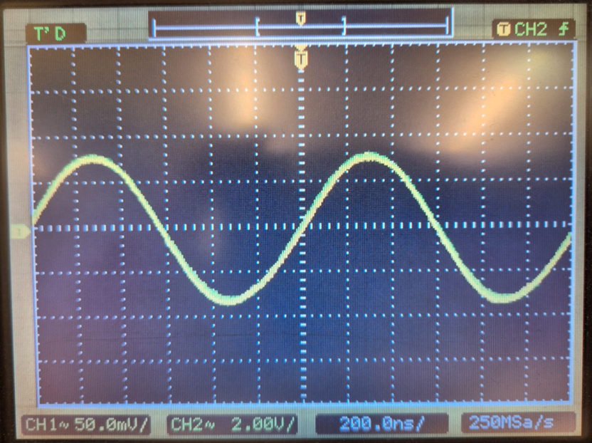{ width=300px }

Voici le tableau des différentes distances et fréquences que nous avons mesurées :

| Liquide        | x1 [mm] | x2 [mm] | fréquence [Hz] |
|----------------|---------|---------|----------------|
| Eau distillée  | 1,81    | 3,64    |     816'600    |
| Glycérine      | 2,14    | 4,49    |     817'800    |
| Éthanol        | 4,69    | 6,10    |     818'000    |

### Dans la vie de tous les jours

Dans la vie de tous les jours, on retrouve la propagation d'une onde avec la vitesse de phase dans pas mal de cas, comme par exemple :

- Les échographies médicales :
Dans les échographies (en mode continu), aussi appelée échographie Doppler, on envoie une onde presque continue dans le corps pour mesurer la vitesse de sang. La vitesse de phase est essentielle pour calculer le décalage Doppler, déterminer la vitesse du flux sanguin et calibrer l'appareil pour que les distances soient correctent.

- Sonar et navigation sous-marine :
  Les sonars utilisent uniquement des ondes continues pour : détecter des potentiels obstacles, mesurer la profondeur actuelle et cartographier les fonds marins. La vitesse de phase dans l'eau, qui est estimée à 1500 m/s, est un paramètre fondamental pour convertir le temps de propagation en distance.

  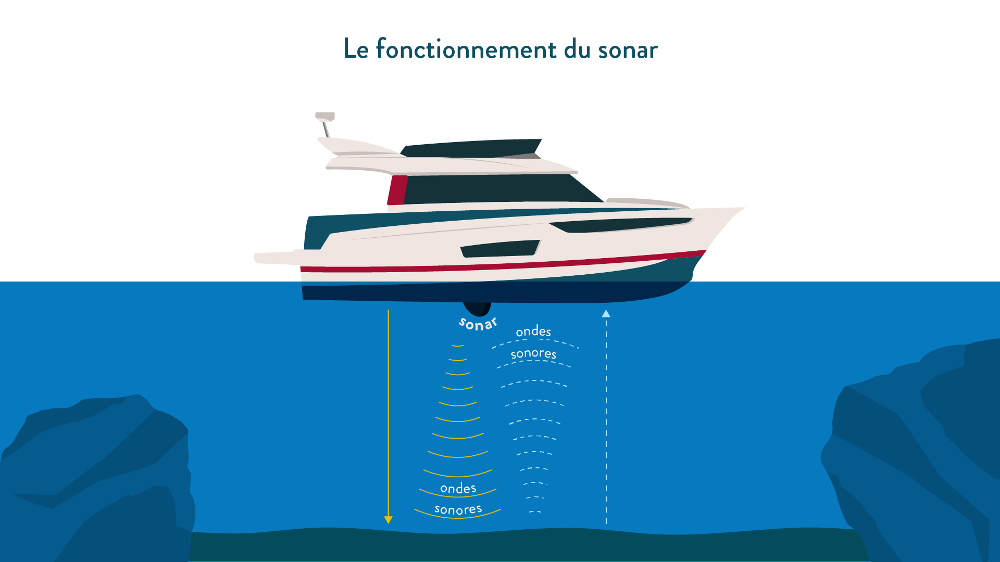{ width=300px }

- Contrôle industriel :
Dans certaines industries, on envoie une onde ultrasonore continue dans un matériau pour mesurer : L'épaisseur d'une plaque, la présence potentielle de défauts internes ou la qualité d'une soudure.
La vitesse de phase dans le matériau doit être connue afin que la plécision pour la mesure soit fiable.

### Calculs & Analyse des résultats

Avec le tableau des résultats représenté ci-dessus, nous pouvons maintenant calculer le $\lambda$ et les incertitudes.

Voici le tableau des résultats :

| Liquide        | $\lambda$ [mm] | $\lambda$ [m] | $\Delta \lambda$[mm] | $\Delta f$ [Hz] | v [m/s] | $\Delta v$ [m/s] |
|----------------|----------------|---------------|----------------------|-----------------|---------|------------------|
| Eau distillée  |      1,83      |    0,00183    | 0,7 * $10^{-3}$      |        5        |  1'496  |   577            |
| Glycérine      |      2,35      |    0,00235    | 0,7 * $10^{-3}$      |        5        |  1'922  |   578            |
| Éthanol        |      1,45      |    0,00145    | 0,7 * $10^{-3}$      |        5        |  1'186  |   578            |

Pour l'analyse des résultats obtenus, nous pouvons voir que les incertitudes sur la vitesse sont énormes. Cela est lié au fait que nous avons beaucoup de problème pour lire correctement les valeurs des positions car le système de mesure était peu stable et surtout difficile à lire.

Concernant les valeurs de la vitesse de propagation trouvée, nous remarquons que ces dernières sont très près des valeurs données par la consigne. Voici un tableau qui les compare :

Comme la vitesse donnée est entre 20°C et 25°C, nous avons pris la moyenne entre les 2 valeurs afin de retrouver une valeur à approximativement 22°C.
Sachant que $v_i$ est la valeur numérique donnée dans la notice du laboratoire.

| Liquide        |      $v_i$ [m/s] |  v [m/s] |      $v_i$ - v [m/s]| erreur en [%] |
|----------------|------------------|----------|---------------------|---------------|
| Eau distillée  |      1'497       |  1'496   |         -1          |     -0,66     |
| Glycérine      |      1'914       |  1'922   |         -8          |     -0,42     |
| Éthanol        |      1'194       |  1'186   |          8          |      0,67     |

Comme pour chaque mesure nous avons une erreur qui se trouve en dessous de $\pm$ 1%, nous sommes satisfaite de nos mesures.
Bien sûr comme nous ne sommes pas sûre que la température du laboratoire au moment où nous avons fait nos expériences, nous ne pouvons pas être certaines que toutes les mesures sont correctes mais du moins, elles se rapprochent de la valeur voulue.

### 2e Manipulation : Mesure de la vitesse de groupe dans l'eau distillé

### Introduction manip 2

Pour cette deuxième partie de l'expérience, nous devions mesurer la vitesse de groupe des ultrasons dans l'eau distilée à l'aide du montage émetteur-récepteur. Contrairement à la vitesse de phase, qui caractérise la propagation d'une onde sinusoïdale infinie, la vitesse de groupe correspond à la vitesse de propagation d'un paquet d'onde, c'est-à-dire d'un signal de durée finie.

Dans notre cas, le quartz émetteur (QE) peut fontionner en régime impulsionnel. Il envoie donc des impulsions acoustiques brèves, qui se répètent à environ 1kHz. Le quartz récepteur (QR) détecte les impulsions après la propagation dans le liquide.

Normalement, comme nous sommes dans un milieu homogène et non dispersif, nous devrions retrouver à peu près la même vitesse que nous avons calculée pour la vitesse de phase, soit 1496 m/s.

### Dans la vie de tous les jours manip 2

Pour ces exemples de la vie courante, nous allons reprendre les 2 premiers exemples pris pour la première manipulation. Soit :

- Les échogrpahies médicales :
  Dans les échographies médicales, il existe un autre mode d'utilisation qui est le mode impulsionnel. Les échographies classiques qui donnent des imageries 2D, fonctionnent en envoyant des impulsions utlrasonores dans le corps. La vitesse de groupe est donc utilisée pour déterminer la profondeur d'un organe, reconstruire une image en temps réel ou localiser avec précision les interfaces (soit les os, muscles ou les organes). C'est une méthode qui permet une meilleure précision sur un point / endroit bien précis. Si l'image de groupe n'est pas connue, l'image serait déformée. Déformée car un échographe reconstruit toute la géométrie interne du coprs seulement à partir du temps que mettent les impulsions ultrasonores à revenir.

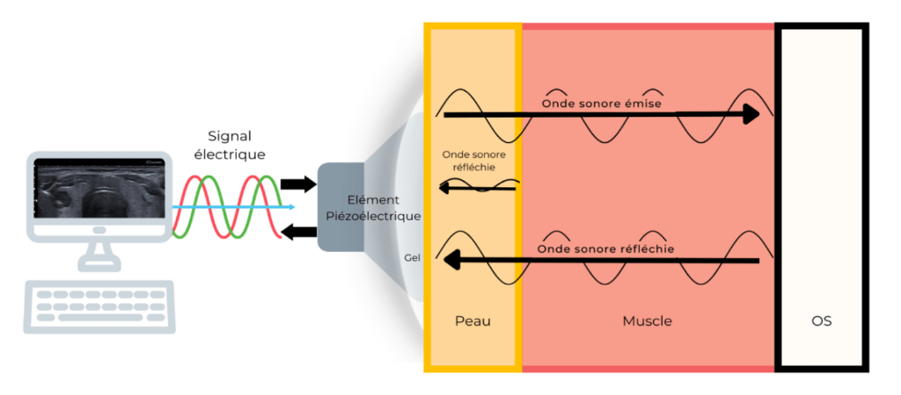{ width=300px }

- Les radars :
  Dans les radars, on utilise le même principe que pour les échographies mais avec des ondes électromagnétiques. Les radars vont envoyer des impulsions pour mesurer la distance d'un avion, la vitesse d'une voiture ou encore la position d'un drône. La vitesse de groupe est utilisée pour convertir un temps de retour en distance.

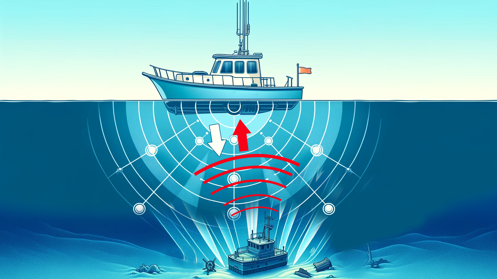{ width=300px }

- La télécommunication (la fibre optique) :
  Dans la fibre optique, des signaux sont envoyés sous forme de pleins d'impulsions lumineuses. La vitesse de groupe va déterminer le temps de propagation du signal, la latence d'internet ou encore la dispersion des impulsions (qui déterminent la limite du débit maximale).
  Cet exemple est parfait car c'est un milieu dispersif, contrairement aux liquides de notre expérience.

### Calculs & Analyse des résultats manip 2

Pour pouvoir montrer la propagation dans le liquide, dans notre cas l'eau distillée, voici une image de nos mesures :

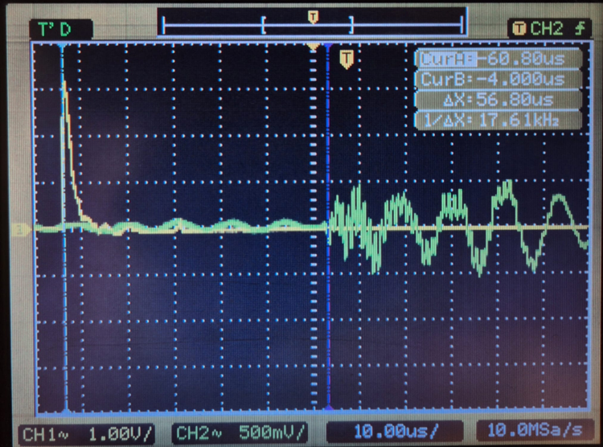{ width=300px }

Voici le tableau indiquant les résultats des calculs effectués.

|$\Delta x$  [mm]| $\Delta t$ [s] |$\Delta v_g$ [s] |
|----------------|----------------|-----------------|
|0,7 * $10^{-3}$ |    0,028       |       0, 36     |

| Liquide        | x1 [mm] | x2 [mm] |     t1 [s]   |   t2 [s]     | x [mm] |    t [s]    | $v_g$ [m/s] |
|----------------|---------|---------|--------------|--------------|--------|-------------|-------------|
| Eau distillée  | 0,0706  | 0,0806  |$56,7*10^{-6}$| $50*10^{-6}$ | 0,01   |$7,7*10^{-6}$|     1'493   |

Comme dans la théorie nous avions souligné le fait d'être dans un milieu non dispersif, nous allons le vérifier en comparant cette valeur obtenue avec la valeur donnée dans la notice du laboratoire.

Voici le tableau comparatif :

| Liquide        |      $v_i$ [m/s] |  $v_g$ [m/s] |    $v_i - v_g$ [m/s]| erreur en [%] |
|----------------|------------------|--------------|---------------------|---------------|
| Eau distillée  |      1'497       |    1'493     |         4           |     0,27      |

Nous constatons donc que la valeur trouvée pour la vitesse de groupe est très proche de celle donnée dans la notice. Nous nous trouvons donc bel et bien dans un milieu non dispersif.

### Conclusion

Récapitulons les résultats de la première manipulation.

Nous avons eu un gros problème avec les valeurs de l'incertitude de $\Delta v$ qui vaut le 30% de la valeur mesurée lors du laboratoire. Cet écart est directement lié au fait que nous avons eu des difficultés à mesurer précisement la distance x ce qui a grandement augmenté la valeur de $\Delta \lambda$. Le fait que la variation de distance soit très faible et que l'incertitude de la mesure soit grande, cela pose un problème.

Au niveau des valeurs mesurées, nous avons obtenu des résultats qui se rapprochent grandement des valeurs de la consigne du laboratoire. Cela confirme que nous avons effectué correctement les mesures et que les valeurs mesurées sont correctes. Comme nous pouvons le voir, chaque écart entre la valeur donnée et la valeur mesurée est très faible.

Résultats de la vitesse de phase

| Liquide        | $\lambda$ [mm] | f [Hz]     | v = f·$\lambda$ [m/s]  | v_tab [m/s] | Écart [%] |
|----------------|----------------|------------|------------------------|-------------|-----------|
| Eau distillée  | 1.83           | 816600     | 1496                   | 1497        | -0.07     |
| Glycérine      | 2.35           | 817800     | 1922                   | 1914        | +0.42     |
| Éthanol        | 1.45           | 818000     | 1186                   | 1194        | -0.67     |

| Liquide        | Vitesse mesurée [m/s] |
|----------------|-----------------------|
| Eau distillée  | $$1496 \pm 577$$      |
| Glycérine      | $$1922 \pm 578$$      |
| Éthanol        | $$1186 \pm 578$$      |

Maintenant, récapitulons les résultats de la deuxième manipulation.

C'était une manipulation qui pouvait nous faire visualiser plus en détail et surtout plus facilement la vitesse de propagation dans un liquide. Nous avons aussi vu que il y avait une grande différence entre le signal émit et celui qui est reçu. Notre objectif était de pouvoir calculer la vitesse de groupe.
Pour les résultats de nos mesures, nous avons retrouvé une valeur de vitesse de groupe très proche de celle de la vitesse de phase, ce qui confirme le fait que nous sommes dans un milieu non dispersif. Au niveau des écarts, nous sommes en dessous de 1% ce qui reste très bien.

Résultats de la vitesse de groupe :

| Liquide        |      $v_i$ [m/s] |  $v_g$ [m/s] |    $v_i - v_g$ [m/s]| erreur en [%] |
|----------------|------------------|--------------|---------------------|---------------|
| Eau distillée  |      1'497       |    1'493     |         4           |     0,27      |

| Liquide        | Vitesse mesurée [m/s] |
|----------------|-----------------------|
| Eau distillée  | $$1493 \pm 0,36$$     |

Globalement, nous pouvons donc dire que nous avons réussi à prouver les valeurs théoriques grâce à nos mesures.
Comme sythèse, nous pouvons souligner :

- Les vitesses de phase mesurées dans trois liquides sont toutes à moins de 1 % des valeurs tabulées.
- La vitesse de groupe mesurée dans l’eau distillée est pratiquement identique à la vitesse de phase.
- Les incertitudes sur $\lambda$ dominent l’erreur dans la première manipulation.
- L’eau se comporte comme un milieu non dispersif pour les ultrasons autour de 800 kHz.

\newpage

## Experience 2 : Propagation d'ondes longitudinales et transversales dans un barreau

### But de l'expérience

Le but de cette expérience est de mesurer la vitesse de propagation d'une onde longitudinale dans différents barreaux. Pour cela nous allons analyser l'onde qui se propage dans le barreau à l'aide d'un capteurs placé à la fin du barreau. Ainsi en connaissant la fréquence de l'onde émise et la distance entre le point d'émission et le capteur, nous pourrons en déduire la vitesse de propagation de l'onde dans le barreau. 

### Rappels théoriques

On est ici dans le cas d'une onde longitudinale se propageant dans un barreau. La vitesse de propagation $v$ de l'onde est reliée au module d'Young $E$ et à la masse volumique $\rho$ du matériau par la relation suivante:

| - | Barreau solide | Unité |
| ------ | ------ | ------ |
| Facteur de force de rappel | $E$ module d'Young | $GPa$ |
| Facteur d'inertie | $\rho$ masse volumique | $kg/m^3$ |
| Vitesse de l'onde | $v = \sqrt{\frac{E}{\rho}}= \lambda f = \dfrac{\lambda}{T}$ | $m/s$ |

### Montage expérimental

Nous allons utiliser le montage suivant:

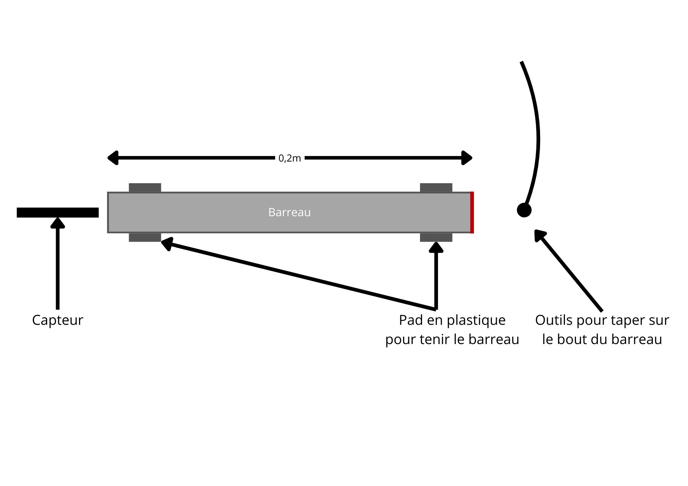{#fig:QE width=80%}

La marche à suivre est la suivante:
1. Nous plaçons le barreau sur des supports pour qu'il soit libre de vibrer.
2. Nous plaçons le capteur à l'extrémité du barreau.
3. Nous émettons une onde longitudinale en tapant sur le barreau avec un petit "marteau".
4. Nous enregistrons le signal reçu par le capteur à l'aide d'un oscilloscope.
5. Nous analysons le signal pour déterminer la période $T$ de l'onde.
6. Nous répétons les étapes 3 à 5 pour différents barreaux.

L'oscilloscope nous permet d'afficher le signal reçu par le capteur sur nos ordinateurs. Nous pouvons ainsi mesurer la période $T$ de l'onde en observant le temps entre deux crêtes successives du signal.

### Résultats de l'expérience

Nous avons effectué des mesures sur cinq barreaux différents: un barreau en aluminium, un barreau en laiton, un barreau en acier, un en verre et un en bois. Pour chaque barreau, nous avons emis des ondes en tapant dessus avec un petit "marteau" et nous avons enregistré la réponse à l'aide d'un capteur placé à l'extrémité du barreau. Voici les résultats obtenus:

#### Barreau en aluminium

- Longueur du barreau: $L_{Al} = 0.2 \pm 0.001 m$
- Masse volumique: $\rho_{Al} = 2700 kg/m^3$ (CRM)
- Module d'Young: $E_{Al} = 70 GPa$ (CRM)

Vitesse théorique:

$$v_{Al} = \sqrt{\frac{E_{Al}}{\rho_{Al}}} = \sqrt{\frac{70 \times 10^9}{2700}} \approx 5091 m/s$$

Ici pas d'incertitude car ce sont des valeurs de référence.

Vitesse mesurée:

- $T_{Al} = 40.9 \times 10^{-6} \pm 3 \times 10^{-6} s$ (temps entre deux crêtes successives)

$$v_{Al,mes} = \frac{L_{Al}}{T_{Al}} = \frac{0.2}{40.9 \times 10^{-6}} = 4888 m/s$$

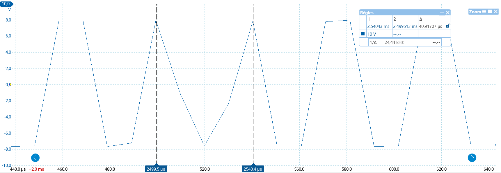{ width=600px }

Incertitude sur la vitesse mesurée:

- Incertitude sur la longueur: $\Delta L_{Al} = 0.001 m$
- Incertitude sur la période: $\Delta T_{Al} = 3 \times 10^{-6} s$

$\delta v_{Al,mes} = v_{Al,mes} \sqrt{\left(\frac{\Delta L_{Al}}{L_{Al}}\right)^2 + \left(\frac{\Delta T_{Al}}{T_{Al}}\right)^2} = 4888 \times 0.073 = 356 m/s$

Donc la vitesse mesurée dans le barreau en aluminium est:

$$v_{Al,mes} = 4888 \pm 356 m/s$$

On voit que la vitesse mesurée est en accord avec la vitesse théorique dans les limites de l'incertitude.

#### Barreau en laiton

- Longueur du barreau: $L_{CuZn} = 0.2 \pm 0.001 m$
- Masse volumique: $\rho_{CuZn} = 8470 kg/m^3$ (CRM)
- Module d'Young: $E_{CuZn} = 100 GPa$ (CRM)

Vitesse théorique:

$$v_{CuZn} = \sqrt{\frac{E_{CuZn}}{\rho_{CuZn}}} = \sqrt{\frac{100 \times 10^9}{8470}} \approx 3436 m/s$$

Ici pas d'incertitude car ce sont des valeurs de référence.

Vitesse mesurée:

- $T_{CuZn} = 61.0 \times 10^{-6} \pm 3 \times 10^{-6} s$ (temps entre deux crêtes successives)

$$v_{CuZn,mes} = \frac{L_{CuZn}}{T_{CuZn}} = \frac{0.2}{61.0 \times 10^{-6}} = 3278 m/s$$

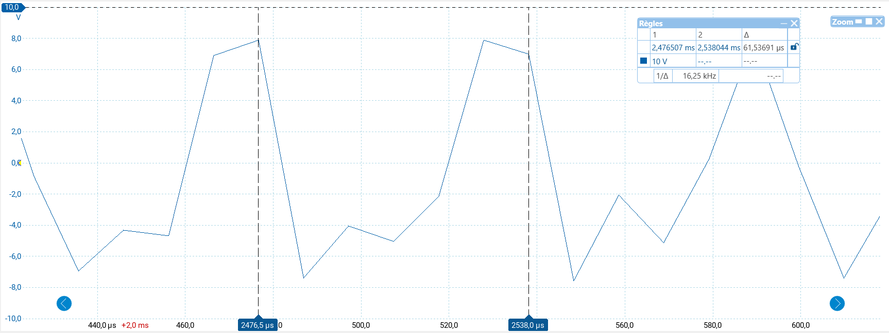{ width=600px }

Incertitude sur la vitesse mesurée:

- Incertitude sur la longueur: $\Delta L_{CuZn} = 0.001 m$
- Incertitude sur la période: $\Delta T_{CuZn} = 3 \times 10^{-6} s$

$$\delta v_{CuZn,mes} = v_{CuZn,mes} \sqrt{\left(\frac{\Delta L_{CuZn}}{L_{CuZn}}\right)^2 + \left(\frac{\Delta T_{CuZn}}{T_{CuZn}}\right)^2} = 3278 \sqrt{\left(\frac{0.001}{0.2}\right)^2 + \left(\frac{3 \times 10^{-6}}{61.0 \times 10^{-6}}\right)^2} \approx 3278 \sqrt{(0.005)^2 + (0.049)^2} \approx 3278 \times 0.049 = 161 m/s$$

Donc la vitesse mesurée dans le barreau en laiton est:

$$v_{CuZn,mes} = 3278 \pm 161 m/s$$

On voit que la vitesse mesurée est en accord avec la vitesse théorique dans les limites de l'incertitude.

#### Barreau en acier

- Longueur du barreau: $L_{Fe} = 0.2 \pm 0.001 m$
- Masse volumique: $\rho_{Fe} = 7850 kg/m^3$ (CRM)
- Module d'Young: $E_{Fe} = 200 GPa$ (CRM)

Vitesse théorique:

$$v_{Fe} = \sqrt{\frac{E_{Fe}}{\rho_{Fe}}} = \sqrt{\frac{200 \times 10^9}{7850}} \approx 5051 m/s$$

Ici pas d'incertitude car ce sont des valeurs de référence.

Vitesse mesurée:

- $T_{Fe} = 41.08 \times 10^{-6} \pm 3 \times 10^{-6} s$ (temps entre deux crêtes successives)

$$v_{Fe,mes} = \frac{L_{Fe}}{T_{Fe}} = \frac{0.2}{41.08 \times 10^{-6}} = 4868 m/s$$

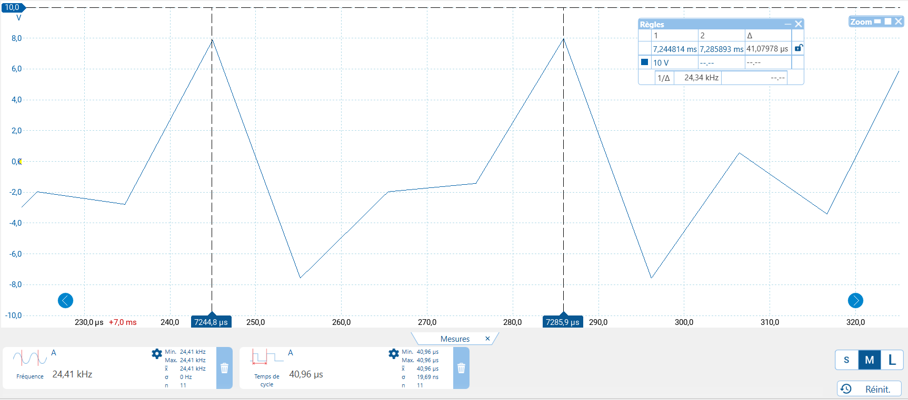{ width=600px }

Incertitude sur la vitesse mesurée:

- Incertitude sur la longueur: $\Delta L_{Fe} = 0.001 m$
- Incertitude sur la période: $\Delta T_{Fe} = 3 \times 10^{-6} s$

$$\delta v_{Fe,mes} = v_{Fe,mes} \sqrt{\left(\frac{\Delta L_{Fe}}{L_{Fe}}\right)^2 + \left(\frac{\Delta T_{Fe}}{T_{Fe}}\right)^2} = 4868 \times 0.073 = 355 m/s$$

Donc la vitesse mesurée dans le barreau en acier est:

$$v_{Fe,mes} = 4868 \pm 355 m/s$$

On voit que la vitesse mesurée est en accord avec la vitesse théorique dans les limites de l'incertitude.

#### Barreau en verre

- Longueur du barreau: $L_{Verre} = 0.4 \pm 0.005 m$
- Masse volumique: $\rho_{Verre} = 2500 kg/m^3$ (CRM)
- Module d'Young: $E_{Verre} = 70 GPa$ (CRM)

Vitesse théorique:

$$v_{Verre} = \sqrt{\frac{E_{Verre}}{\rho_{Verre}}} = \sqrt{\frac{70 \times 10^9}{2500}} \approx 5291 m/s$$

Ici pas d'incertitude car ce sont des valeurs de référence.

Vitesse mesurée:

- $T_{Verre} = 82.0 \times 10^{-6} \pm 3 \times 10^{-6} s$ (temps entre deux crêtes successives)

$$v_{Verre,mes} = \frac{L_{Verre}}{T_{Verre}} = \frac{0.4}{82.0 \times 10^{-6}} = 4878 m/s$$

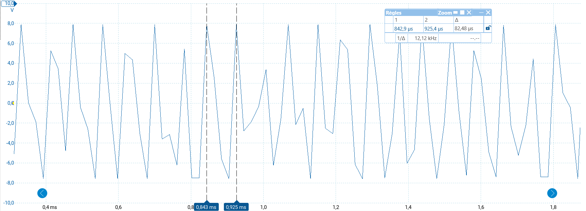{ width=600px }

Incertitude sur la vitesse mesurée:

- Incertitude sur la longueur: $\Delta L_{Verre} = 0.005 m$
- Incertitude sur la période: $\Delta T_{Verre} = 3 \times 10^{-6} s$

$$\delta v_{Verre,mes} = v_{Verre,mes} \sqrt{\left(\frac{\Delta L_{Verre}}{L_{Verre}}\right)^2 + \left(\frac{\Delta T_{Verre}}{T_{Verre}}\right)^2} = 4878 \times 0.039 = 189 m/s$$

Donc la vitesse mesurée dans le barreau en verre est:

$$v_{Verre,mes} = 4878 \pm 189 m/s$$

Avec cette valeur, on est dans le bon ordre de grandeur par rapport à la valeur théorique. Mais on remarque que la valeur mesurée est un peu plus basse que la valeur théorique. Cela peut être dû à des erreurs de mesure ou à des imperfections dans le barreau.

#### Barreau en bois

- Longueur du barreau: $L_{Bois} = 0.2 \pm 0.001 m$
- Masse volumique: $\rho_{Bois} = 600 kg/m^3$ (CRM)
- Module d'Young: $E_{Bois} = 10 GPa$ (CRM)

Vitesse théorique:

$$v_{Bois} = \sqrt{\frac{E_{Bois}}{\rho_{Bois}}} = \sqrt{\frac{10 \times 10^9}{600}} \approx 4082 m/s$$

Ici pas d'incertitude car ce sont des valeurs de référence.

Vitesse mesurée:

- $T_{Bois} = 3.46 \times 10^{-3} \pm 3 \times 10^{-6} s$ (temps entre deux crêtes successives)

$$v_{Bois,mes} = \frac{L_{Bois}}{T_{Bois}} = \frac{0.2}{3.46 \times 10^{-3}} \approx 57.8 m/s$$

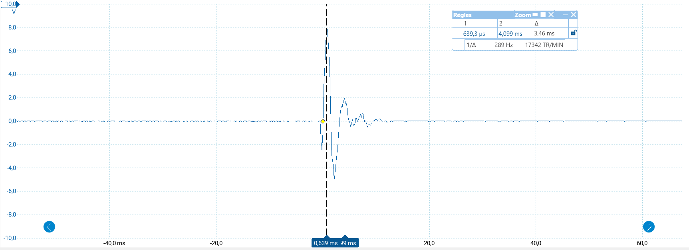{ width=600px }

Incertitude sur la vitesse mesurée:

- Incertitude sur la longueur: $\Delta L_{Bois} = 0.001 m$
- Incertitude sur la période: $\Delta T_{Bois} = 3 \times 10^{-3} s$

$$\delta v_{Bois,mes} = v_{Bois,mes} \sqrt{\left(\frac{\Delta L_{Bois}}{L_{Bois}}\right)^2 + \left(\frac{\Delta T_{Bois}}{T_{Bois}}\right)^2} = 57.8 \times 0.005 = 0.29 m/s$$

Donc la vitesse mesurée dans le barreau en bois est:

$$v_{Bois,mes} = 57.8 \pm 0.29 m/s$$

On voit que la vitesse mesurée est bien en dessous de la vitesse théorique. Cela peut être du au fait qu'on ne connais pas le type de bois utilisé et que les propriétés mécaniques peuvent varier grandement entre les différentes essences de bois. Aussi le bois ne conduit pas très bien les ondes. Nous voyons cela sur le signal reçu ou il n'y a pas beaucoup de crêtes visibles. Il se peut qu'on ai pris une mauvaise période de l'onde.

### A quoi ça sert dans la vie de tous les jours?

La connaissance de la vitesse de propagation des ondes dans différents matériaux est cruciale dans de nombreux domaines d'ingénierie et de physique appliquée. Par exemple, dans le domaine de la construction, comprendre comment les ondes sonores se propagent à travers les matériaux permet de concevoir des bâtiments avec une meilleure isolation acoustique. De plus, dans l'industrie automobile et aérospatiale, la connaissance des propriétés des matériaux aide à optimiser la résistance aux vibrations et aux chocs, améliorant ainsi la sécurité et le confort.

### Conclusion manip 1

Dans cette expérience, nous avons mesuré la vitesse de propagation d'une onde longitudinale dans trois types de barreaux: aluminium, laiton et acier. Pour chaque matériau, nous avons comparé la vitesse mesurée avec la vitesse théorique calculée à partir du module d'Young et de la masse volumique. Nos résultats montrent que les vitesses mesurées sont en bon accord avec les vitesses théoriques, ce qui confirme la validité de la relation entre la vitesse de l'onde, le module d'Young et la masse volumique. Les incertitudes associées à nos mesures sont raisonnables et n'affectent pas significativement la conclusion de l'expérience.

### Onde transversale

Pour l'onde transversale, nous avons fait une observation qualitative. En méttant 2 capteurs sur le barreau, un à chaque extrémité, nous avons tapé sur le barreau pour générer une onde transversale. En tapant au milieu du barreau, nous avons observé que les deux capteurs enregistraient des signaux similaires, indiquant que l'onde s'était propagée dans les deux directions.

Voici une image des signaux enregistrés par les deux capteurs:

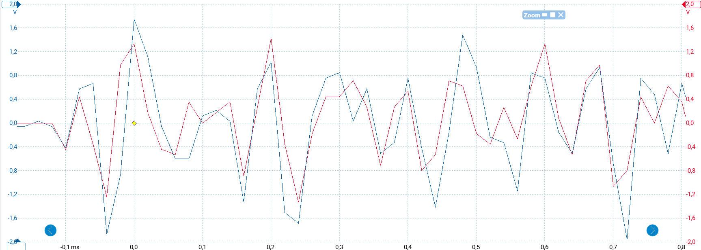{ width=600px }

### Conclusion manip 2

Dans cette partie de l'expérience, nous avons observé la propagation d'une onde transversale dans un barreau en tapant au milieu. Les signaux enregistrés par les deux capteurs placés aux extrémités du barreau montrent que l'onde s'est propagée dans les deux directions à partir du point d'impact. Cette observation qualitative confirme le comportement attendu des ondes transversales dans un solide, où les particules du matériau oscillent perpendiculairement à la direction de propagation de l'onde.

\newpage

## Experience 3 : Cuve à ondes

### But de l'expérience

Une cuve à ondes est un dispositif utilisé pour étudier la propagation des ondes à la surface de l'eau. En générant des ondes à une extrémité de la cuve, on peut observer comment elles se propagent, se réfléchissent et interagissent avec des obstacles.

Ici notre but va être de déterminer la vitesse de propagation des ondes à la surface de l'eau en fonction de la fréquence des ondes générées, aussi de montrer l'effet Doppler avec une source mobile et enfin d'observer des phénomènes d'interférences entre deux sources d'ondes.

### Montage expérimental

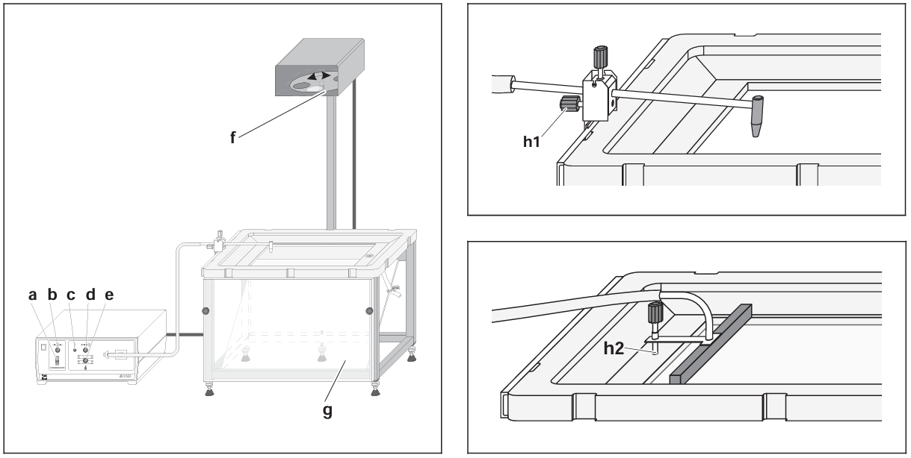{#fig:QE width=80%}

- a : interrupteur du stroboscope
- b : bouton (réglage fin de la fréquence du stroboscope)
- c : bouton poussoir (excitation d’ondes uniques)
- d : bouton (réglage de l‘amplitude de l’excitation d’ondes)
- e : bouton (réglage de la fréquence de l‘excitation d’ondes)
- f : vis moletée (rotation manuelle du disque stroboscopique)
- g : écran d’observation
- h1 : Raccord d’un excitateur d’ondes circulaires
- h2 : Raccord d’un excitateur d’ondes rectilignes

Sur l'image de gauche on peut voir le dispositif au complet avec le générateur d'ondes (air) et la cuve à ondes. Sur l'image en haut à droite on peut voir un zoom sur la cuve à ondes avec le générateur d'ondes circulaire immergé dans l'eau et sur l'image en bas à droite on peut voir le générateur d'ondes linéaire immergé dans l'eau.

### Calibration de la cuve à ondes

Pour calibrer la cuve à ondes, nous avons utilisé un petit bâton de $97 mm$ que nous avons posé dans la cuve afin d'observer son image sur l'écran. En mesurant la longueur de l'image projetée sur l'écran, nous avons pu déterminer le facteur de grossissement de la cuve à ondes.

| Longueur réelle du bâton | Longueur de l'image projetée |
| ------------------------ | ---------------------------- |
| $97 \pm 0.5 mm$          | $158 \pm 1 mm$             |

Le facteur de grossissement $G$ est donné par la formule:

$$G = \frac{\text{Longueur de l'image}}{\text{Longueur réelle}} = \frac{158 mm}{97 mm} \approx 1.63$$

Ce qui veut dire que lorsque nous mesurons une distance sur l'écran, nous devons la diviser par $1.63$ pour obtenir la distance réelle dans la cuve à ondes.

Incertitude sur le facteur de grossissement:

$$\Delta G = G \sqrt{\left(\frac{\Delta \text{Longueur de l'image}}{\text{Longueur de l'image}}\right)^2 + \left(\frac{\Delta \text{Longueur réelle}}{\text{Longueur réelle}}\right)^2} = 1.63 \sqrt{\left(\frac{1 mm}{158 mm}\right)^2 + \left(\frac{0.5 mm}{97 mm}\right)^2} \approx 1.63 \sqrt{(0.00633)^2 + (0.00515)^2} \approx 1.63 \times 0.0082 \approx 0.013$$

Donc le facteur de grossissement est: $G = 1.63 \pm 0.013$

### Mesure de la vitesse des ondes en fonction de la fréquence

Nous avons généré des ondes à différentes fréquences en utilisant le générateur d'ondes linéaire. Pour chaque fréquence, nous avons mesuré la longueur d'onde des ondes générées en observant la distance entre deux crêtes successives.

Nous allons utiliser la formule de la vitesse des ondes $v = \lambda f$ et calculer l'incertitude associée avec la formule $\delta v = v \sqrt{\left(\frac{\Delta \lambda}{\lambda}\right)^2 + \left(\frac{\Delta f}{f}\right)^2}$. L'incertitude sur la longueur d'onde réelle est donnée par $\Delta \lambda = \frac{\Delta \lambda_{mes}}{G}$ où $\Delta \lambda_{mes}$ est l'incertitude sur la longueur d'onde mesurée sur l'écran qui est égale à $0.013$.

| Fréquence (Hz) | Longueur d'onde mesurée sur l'écran (m) | Longueur d'onde réelle (m) | Vitesse des ondes (m/s) |
| -------------- | ----------------------------------------- | --------------------------- | ----------------------- |
| $30 \pm 2$ | $0.014 \pm 0.002$ | $0.0086 \pm 0.0005$ | $0.258 \pm 0.023$ |
| $40 \pm 2$ | $0.010 \pm 0.002$ | $0.0061 \pm 0.0005$ | $0.246 \pm 0.024$ |
| $50 \pm 2$ | $0.008 \pm 0.002$ | $0.0049 \pm 0.0005$ | $0.247 \pm 0.027$ |
| $60 \pm 2$ | $0.007 \pm 0.002$ | $0.0043 \pm 0.0005$ | $0.257 \pm 0.031$ |
| $70 \pm 2$ | $0.006 \pm 0.002$ | $0.0037 \pm 0.0005$ | $0.257 \pm 0.035$ |

### Analyse des résultats

En analysant les résultats obtenus, nous pouvons observer que la vitesse des ondes à la surface de l'eau reste relativement constante autour de $0.253 m/s$ pour les fréquences testées. Cela est cohérent avec la théorie des ondes de surface dans un liquide peu profond, où la vitesse dépend principalement de la gravité et de la profondeur de l'eau. Aussi toutes les valeurs de la vitesse des ondes sont compatibles entre elles dans les incertitudes.

### Effet Doppler

Grâce à la cuve à ondes, nous avons pu observer l'effet Doppler en déplaçant une source d'ondes circulaires. N'ayant pas de moyen de mesurer précisément la vitesse de la source, nous allons nous contenter d'observer qualitativement le phénomène.

#### Rappels théoriques

L'effet Doppler est un phénomène physique qui se manifeste par une variation de la fréquence perçue d'une onde lorsqu'il y a un mouvement relatif entre la source de l'onde et l'observateur. Lorsque la source se rapproche de l'observateur, la fréquence perçue augmente (décalage vers le bleu), tandis que lorsque la source s'éloigne, la fréquence perçue diminue (décalage vers le rouge).

La formule générale de l'effet Doppler pour une onde se propageant dans un milieu est donnée par:

$$f' = f \frac{v + v_o}{v + v_s}$$

où:

- $f'$ est la fréquence perçue par l'observateur,
- $f$ est la fréquence émise par la source,
- $v$ est la vitesse de l'onde dans le milieu,
- $v_o$ est la vitesse de l'observateur par rapport au milieu (positive si l'observateur se rapproche de la source),
- $v_s$ est la vitesse de la source par rapport au milieu (positive si la source s'éloigne de l'observateur).

#### Observation expérimentale

Pour cette experience nous avons juste déplacer le générateur d'ondes circulaires rapidement de haut en bas et de bas en haut dans la cuve à ondes. Nous avons pu observer que lorsque la source se déplaçait vers le haut, les crêtes des ondes étaient plus rapprochées, indiquant une fréquence plus élevée. Inversement, lorsque la source se déplaçait vers le bas, les crêtes des ondes étaient plus espacées, indiquant une fréquence plus basse.

Nous avons aussi vu le phénomène de cônes de Mach lorsque la source se déplaçait plus vite que la vitesse des ondes dans le milieu, formant un angle caractéristique avec la direction du mouvement.

Voici une illustration de l'effet Doppler et du cône de Mach observé dans la cuve à ondes:

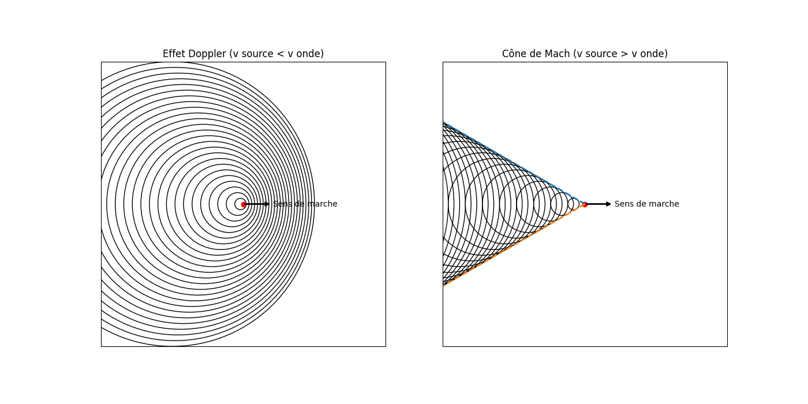{#fig:QE width=80%}

Ici on peut voir que les ondes sont plus rapprochées devant la source en mouvement (fréquence plus élevée) et plus espacées derrière la source (fréquence plus basse). 

La valeur de l'angle $\theta$ du cône de Mach peut être reliée à la vitesse de la source $v_s$ et à la vitesse des ondes $v$ par la relation:

$$\sin(\theta) = \frac{v}{v_s}$$

En mesurant cet angle, nous pourrions estimer la vitesse de la source par rapport à la vitesse des ondes dans la cuve.

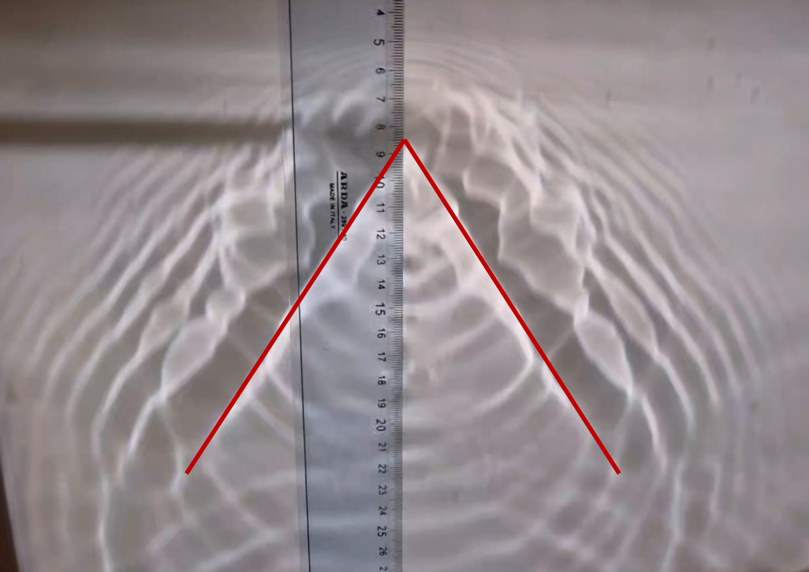{#fig:QE width=80%}

Ici l'angle $\theta$ peut être mesuré pour estimer la vitesse de la source.

$\theta \approx 66^\circ \pm 1^\circ$

Donc avec $v$ repris de l'expérience précédente, soit $v = 0.253 m/s$.':

$$\sin(66^\circ) = \frac{v}{v_s} \Rightarrow v_s = \frac{v}{\sin(66^\circ)} = \frac{0.253 m/s}{0.9135} \approx 0.277 m/s$$

Incertitude sur la vitesse de la source:

$$\Delta v_s = v_s \sqrt{\left(\frac{\Delta v}{v}\right)^2 + \left(\frac{\Delta \sin(\theta)}{\sin(\theta)}\right)^2} = 0.277 \sqrt{\left(\dfrac{0.07}{0.253}\right)^2 + \left(\dfrac{0.017}{0.914}\right)^2} = 0.0757$$

Donc la vitesse estimée de la source est:

$$v_s = 0.277 \pm 0.076 m/s$$

#### Dans la vie de tous les jours

On retrouve l'effet Doppler dans de nombreux phénomènes quotidiens. Par exemple, le son d'une sirène d'ambulance ou de police change de hauteur lorsqu'elle passe près de nous, en raison du mouvement de la source sonore par rapport à l'observateur. De même, en astronomie, l'effet Doppler est utilisé pour déterminer la vitesse des étoiles et des galaxies par rapport à la Terre, ce qui aide à comprendre l'expansion de l'univers. Enfin, les radars de vitesse utilisent également l'effet Doppler pour mesurer la vitesse des véhicules en mouvement.

Pour le cône de Mach, on le retrouve dans les avions supersoniques. Lorsqu'un avion dépasse la vitesse du son, il crée un cône de Mach similaire à celui observé dans la cuve à ondes, ce qui peut entraîner un bang sonique entendu au sol.

#### Conclusion

L'expérience de l'effet Doppler dans la cuve à ondes nous a permis d'observer qualitativement le phénomène de variation de fréquence perçue en fonction du mouvement relatif entre la source et l'observateur. En déplaçant la source d'ondes circulaires, nous avons constaté que les crêtes des ondes se rapprochaient lorsque la source se déplaçait vers le haut et s'éloignaient lorsqu'elle se déplaçait vers le bas, illustrant ainsi l'effet Doppler. De plus, nous avons observé la formation d'un cône de Mach lorsque la source se déplaçait plus rapidement que la vitesse des ondes dans le milieu, ce qui a permis d'estimer la vitesse de la source par rapport à la vitesse des ondes. Ces observations confirment les principes fondamentaux de l'effet Doppler et démontrent son importance dans la compréhension des phénomènes ondulatoires dans divers contextes physiques.

### Interférences entre deux sources d'ondes

Pour cette expérience, nous avons utilisé deux générateurs d'ondes circulaires placés à une distance fixe l'un de l'autre dans la cuve à ondes. En réglant les deux générateurs pour qu'ils émettent des ondes à la même fréquence et en phase, nous avons pu observer le phénomène d'interférences entre les ondes générées par les deux sources.

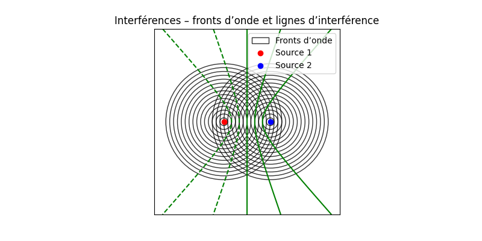{#fig:QE width=80%}

#### Rappels théoriques

Lorsque deux ondes se superposent, elles peuvent interférer de manière constructive ou destructive en fonction de leur phase relative. L'interférence constructive se produit lorsque les crêtes des deux ondes coïncident, ce qui amplifie l'amplitude résultante. En revanche, l'interférence destructive se produit lorsque la crête d'une onde coïncide avec le creux de l'autre, ce qui réduit l'amplitude résultante.

Voici comment calculer les lignes d'interférence :

$d_c = n \lambda$ pour les interférences constructives (maxima), où $n$ est un entier (0, 1, 2, ...).

$d_d = (n + 0.5) \lambda$ pour les interférences destructives (minima), où $n$ est un entier (0, 1, 2, ...).

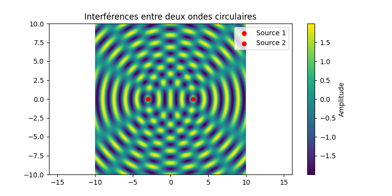{#fig:QE width=80%}

#### Observation expérimentale

En observant l'écran de la cuve à ondes, nous avons pu identifier des zones où les ondes des deux sources s'additionnaient pour former des crêtes plus élevées (interférences constructives) et des zones où les ondes s'annulaient partiellement (interférences destructives).

Voici une photo prise de l'écran montrant les motifs d'interférence:

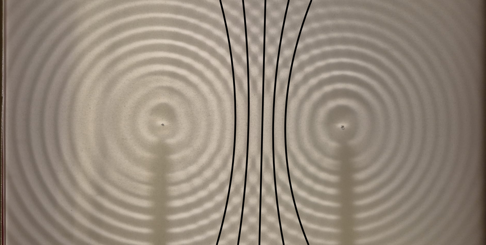{#fig:QE width=80%}

Avec en noir les hyperboles d'interférences.

Avec $\lambda \approx \dfrac{0.008}{1.63} m \approx 0.0049 m$ et la distance entre les deux sources $d = 0.1 m$.

$$d_c = \lambda = 0.0049m$$

$$d_c = 2 \lambda = 0.0098m$$

$$d_c = 3 \lambda = 0.0147m$$

$$d_d = (0.5) \lambda = 0.00245m$$

$$d_d = (1.5) \lambda = 0.00735m$$

$$d_d = (2.5) \lambda = 0.01225m$$

Ces distances correspondent aux positions des maxima et minima d'interférence observés sur l'écran de la cuve à ondes. Pour chaque point sur l'écran, la différence de distance entre les deux sources d'ondes détermine si l'interférence est constructive ou destructive, conformément aux formules mentionnées ci-dessus.

#### Dans la vie de tous les jours

Les interférences entre ondes sont un phénomène courant dans de nombreux domaines de la physique et de la technologie. Par exemple, en acoustique, les interférences peuvent affecter la qualité du son dans une salle de concert, où des ondes sonores provenant de différentes sources peuvent se superposer pour créer des zones de son plus fort ou plus faible. En optique, les interférences sont utilisées dans des dispositifs tels que les interféromètres pour mesurer des distances très précises ou des variations de phase. Dans les télécommunications, les interférences entre signaux peuvent entraîner des perturbations dans la transmission des données, ce qui nécessite des techniques de modulation et de filtrage pour minimiser ces effets.

#### Conclusion

L'expérience des interférences entre deux sources d'ondes dans la cuve à ondes nous a permis d'observer les motifs caractéristiques d'interférence résultant de la superposition des ondes émises par les deux générateurs. En réglant les sources pour qu'elles émettent des ondes à la même fréquence et en phase, nous avons pu identifier clairement les zones d'interférences constructives et destructives sur l'écran de la cuve. Ces observations confirment les principes fondamentaux des interférences ondulatoires et illustrent comment la superposition des ondes peut conduire à des variations significatives de l'amplitude résultante en fonction de la phase relative des ondes impliquées.

### Diffraction des ondes

La diffraction est un phénomène qui se produit lorsque des ondes rencontrent un obstacle ou une ouverture, provoquant une déviation de leur trajectoire. Dans cette expérience, nous avons observé la diffraction des ondes à la surface de l'eau en utilisant la cuve à ondes.

#### Observation expérimentale

En plaçant un obstacle partiel dans le chemin des ondes générées par le générateur d'ondes linéaire, nous avons pu observer comment les ondes se courbaient autour de l'obstacle, créant des motifs de diffraction sur l'écran de la cuve.

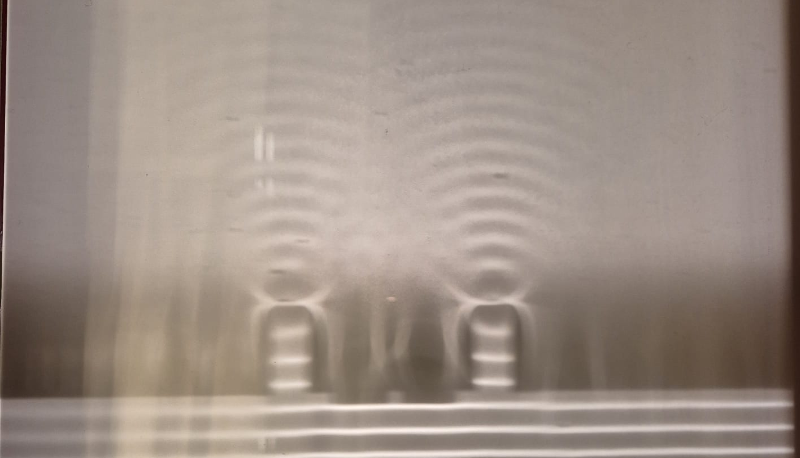{#fig:QE width=80%}

Ce phénomène est interessant car il montre que les ondes ne se propagent pas uniquement en ligne droite, mais peuvent également contourner des obstacles, ce qui est crucial dans de nombreux domaines, tels que l'acoustique, l'optique et les télécommunications.

Comme ici sur l'image, On peut voir que les ondes passent à travers une ouverture et se propagent en formant des cercles, illustrant ainsi le phénomène de diffraction alors que les ondes de base étaient rectilignes.

Ce phénomène peut être expliqué par le principe de Huygens-Fresnel, qui stipule que chaque point d'une onde peut être considéré comme une source secondaire d'ondes sphériques. Lorsque ces ondes secondaires rencontrent un obstacle ou une ouverture, elles interfèrent pour former de nouveaux motifs d'onde.

#### Cas célèbres de diffraction

Un cas assez connu de diffraction est celui des fentes de Young en optique, où la lumière passant à travers deux fentes étroites crée un motif d'interférence caractéristique sur un écran, démontrant la nature ondulatoire de la lumière.

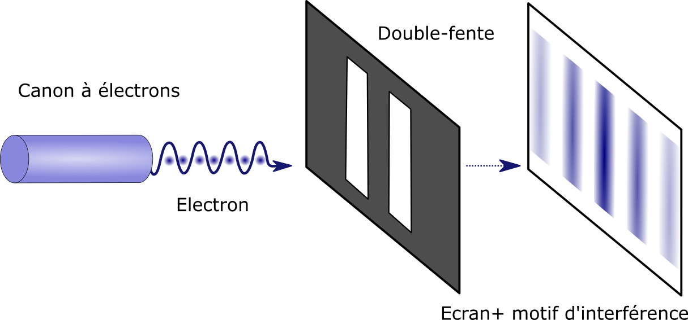{#fig:QE width=80%}

#### Dans la vie de tous les jours

La diffraction des ondes est un phénomène omniprésent dans notre vie quotidienne. Par exemple, lorsque le son d'une source sonore passe à travers une porte entrouverte, il se propage dans la pièce voisine en contournant l'obstacle, permettant ainsi d'entendre la source même si elle n'est pas directement visible. De même, en optique, la diffraction de la lumière est exploitée dans des dispositifs tels que les réseaux de diffraction utilisés pour analyser les spectres lumineux. En radiofréquence, la diffraction des ondes radio permet aux signaux de contourner des obstacles tels que des bâtiments ou des collines, facilitant ainsi la communication dans des environnements urbains ou ruraux.

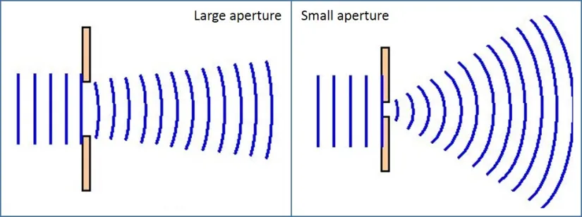{#fig:QE width=80%}

#### Conclusion

Ici nous avons juste fait une courte observation qualitative de la diffraction des ondes à la surface de l'eau dans la cuve à ondes. En plaçant un obstacle partiel dans le chemin des ondes, nous avons pu observer comment les ondes se courbaient autour de l'obstacle, créant des motifs de diffraction caractéristiques. Cette observation illustre le principe fondamental de la diffraction, qui est essentiel pour comprendre le comportement des ondes dans divers contextes physiques.

### Conclusion

Dans cette série d'expériences utilisant la cuve à ondes, nous avons exploré plusieurs phénomènes ondulatoires fondamentaux, notamment la propagation des ondes en fonction de la fréquence, l'effet Doppler, les interférences entre deux sources d'ondes et la diffraction des ondes.
Nous avons mesuré la vitesse des ondes à différentes fréquences et observé que la vitesse restait relativement constante, ce qui est cohérent avec les propriétés des ondes à la surface de l'eau. L'effet Doppler a été illustré qualitativement en déplaçant une source d'ondes, montrant comment la fréquence perçue change en fonction du mouvement relatif entre la source et l'observateur. Les interférences entre deux sources d'ondes ont révélé des motifs caractéristiques d'interférences constructives et destructives, confirmant les principes fondamentaux de la superposition des ondes. Enfin, la diffraction des ondes a été observée en plaçant un obstacle dans le chemin des ondes, démontrant comment les ondes peuvent contourner des obstacles et créer de nouveaux motifs d'onde. Ces expériences ont non seulement renforcé notre compréhension des phénomènes ondulatoires, mais ont également mis en évidence leur pertinence dans divers contextes physiques et technologiques.

## Conclusion générale

Au cours de ce laboratoire, nous avons exploré divers aspects de la propagation des ondes dans différents milieux, en mettant l'accent sur les ultrasons dans les liquides, les ondes longitudinales dans les barreaux solides et les ondes à la surface de l'eau dans une cuve à ondes. Chaque expérience a permis d'approfondir notre compréhension des phénomènes ondulatoires et de leurs applications pratiques.

Pour la première expérience, nous avons mesuré la vitesse de phase et la vitesse de groupe des ultrasons dans différents liquides. Nos résultats ont montré une excellente concordance avec les valeurs tabulées, confirmant la validité de nos méthodes expérimentales malgré les défis rencontrés dans la mesure des incertitudes. Cette experience nous a permis de comprendre comment les échographies médicales utilisent les ultrasons pour visualiser l'intérieur du corps humain ou encore comment les ultrasons sont employés pour les radar de bateaux.

La deuxième expérience a porté sur la propagation des ondes longitudinales dans des barreaux solides. Nous avons mesuré la vitesse de propagation dans des barreaux d'aluminium, de laiton et d'acier, et nos résultats ont également été en bon accord avec les valeurs théoriques. Cette expérience a mis en lumière l'importance des propriétés mécaniques des matériaux, telles que le module d'Young et la masse volumique, dans la détermination de la vitesse des ondes. Cela a des implications directes dans des domaines tels que la construction, l'aéronautique et l'industrie automobile, où la compréhension des vibrations et des chocs est cruciale pour la sécurité et la performance.

Enfin, la troisième expérience a exploré les ondes à la surface de l'eau à l'aide d'une cuve à ondes. Nous avons étudié la vitesse des ondes en fonction de la fréquence, observé l'effet Doppler, les interférences entre deux sources d'ondes et la diffraction des ondes. Ces observations ont illustré les principes fondamentaux des phénomènes ondulatoires et leur pertinence dans divers contextes, allant de l'acoustique à l'optique en passant par les télécommunications.

Aurore Delessert et Magali Tornare

Yverdon-le-Bains, le 15 janvier 2026

\newpage

## Références

https://fr.wikipedia.org/wiki/Propagation_des_ondes

https://www.sciences.univ-nantes.fr/sites/claude_saintblanquet/synophys/31propa/31propa.htm?utm_source=copilot.com

https://www.univdocs.com/2020/05/ondes-et-propagation.html?utm_source=copilot.com