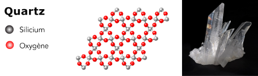
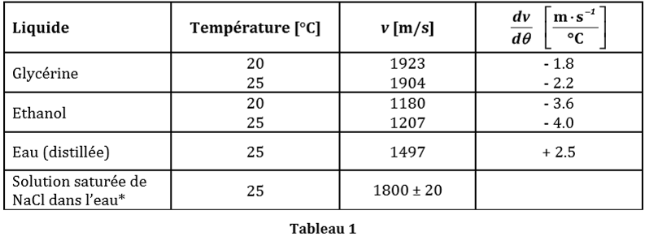
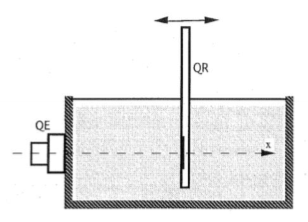
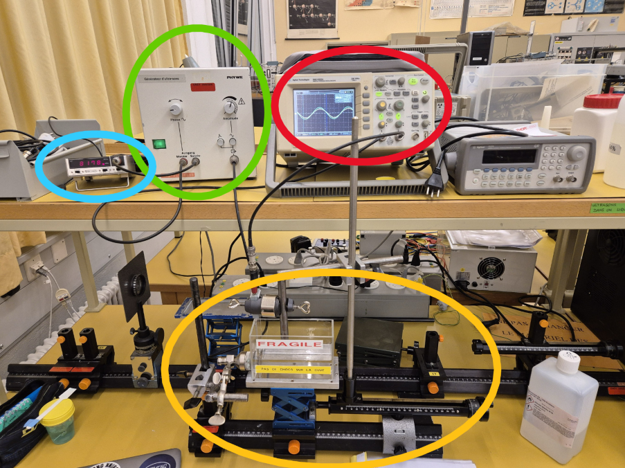

---
header-includes:
  - \usepackage[a4paper, top=2cm, bottom=2cm, left=1.5cm, right=1.5cm]{geometry}
  - \usepackage{fancyhdr}
  - \pagestyle{fancy}
  - \fancyhead[L]{Aurore Delessert \newline Magali Tornare}
  - \fancyhead[R]{Phy3-Labo 02}
  - \fancyfoot[C]{Page \thepage}
  - \usepackage{graphicx}
  - \usepackage{tikz}
  - \usepackage{pgfplots}
  - \pgfplotsset{compat=newest}
  - \usetikzlibrary{arrows.meta}
  - \usepackage{amsmath}
  - \usepackage{capt-of}
  - \usepackage{booktabs}
---

\includegraphics[width=0.25\textwidth]{images/heig-logo.png}

\thispagestyle{empty}
\begin{center}
\vspace*{3cm}

\noindent\rule{\textwidth}{0.4pt}\\[0.6cm]

{\Huge \textbf{Labo 03}}\\[0.5cm]
{\LARGE \textit{Projet sur la propagation des ondes}}\\[0.3cm]
\noindent\rule{\textwidth}{0.4pt}\\[1.5cm]

\begin{center}
\includegraphics[width=\textwidth]{images/Page_de_garde.png} \end{center}

{\Large \textbf{Aurore Delessert, Magali Tornare}}\\
Physique — HEIG-VD\\[1.5cm]

\textbf{Date du laboratoire :} 12 décembre 2025\\
\textbf{Professeure :} Dre Anne-Gabrielle Pawlowski\\
\textbf{Salle de classe :} T06\\[3cm]

\vfill
\end{center}

\clearpage
\setcounter{page}{1}

\tableofcontents

\newpage

## Experience 1: Propagation des ondes ultrasonores dans des milieux liquides

### Introduction

Les ondes acoustiques, qu’est-ce que c’est ?

Une onde acoustique est une perturbation de pression qui se propage dans un milieu fluide/liquide.

Parmi les perturbations sonores, nous retrouvons les ultrasons qui sont des ondes sonores dont la fréquence dépasse les 20kHz, ce qui rend leur perception impossible à entendre par l’oreille humaine. La génération des ondes ultrasonores repose sur un phénomène physique qui est la piézoélectricité. Certains cristaux, comme le quartz par exemple, présentent cette propriété et permettent de convertir une contrainte mécanique en signal électrique et vice-versa.

En effet, le quartz a une structure très spéciale car il n’a pas un centre symétrique, ce qui permet l’apparition d’une polarisation électrique lorsque ce dernier est soumis à une certaine contrainte mécanique. Cette polarisation génère une tension mesurable entre des électrodes.

Comme dis précédemment, ce phénomène est réversible. En appliquant une tension alternative, le cristal entre en vibration à la fréquence du signal. Si cette fréquence est la même que la fréquence du signal, un effet de résonnance se produit et amplifie les vibrations. Ce mécanisme est à la base de la génération des ultrasons dans notre montage.

### Objectifs de l'expérience

L’expérience vise principalement à :  
\begin{itemize}
\item Observer la propagation d’une onde acoustique dans un liquide
\item Mesurer la célérité (donc la vitesse de phase) d’une onde générée dans différents liquides.
\item Mesurer la célérité en groupe (vitesse de groupe d’une onde générée dans un liquide et comparer cette vitesse avec celle de phase.
\end{itemize}

Comme il était demandé d’analyser la vitesse de groupe mais que nous l’avions déjà fait dans un précédent rapport, nous allons essayer de tirer des parallèles entres ces 2 expériences.

### Rappels théoriques

La vitesse de propagation d’une onde acoustique dans un liquide, appelée célérité ou vitesse de phase, dépend de la fréquence de l’onde et de sa longueur d’onde. Pour une onde sinusoïdale, on peut calculer la vitesse avec la formule suivante :

$$v = f \cdot \lambda \quad \text{avec } v~[\text{m/s}],\ f~[\text{Hz}],\ \lambda~[\text{m}]$$

La vitesse peut aussi dépendre des propriétés mécaniques du milieu dans lequel l’onde se propage. Dans ce cas, la formule devient :

$$v = \sqrt{\frac{1}{\rho \cdot \kappa}} \quad \text{avec } \rho~[\text{kg/m}^3],\ \kappa~[\text{Pa}^{-1}]$$\\
textit{où } $\rho$ est la masse volumique du milieu et $\kappa$ sa compressibilité.

Cette formule dépend donc directement les propriétés mécaniques du milieu, en particulier de :

- La compressibilisé $\kappa$ du liquide qui est sa capacité à se comprimer.
- Sa dentisé $\rho$

Chaque liquide possède donc un combinaison différente de densité de compressibilité et de densité. Cela explique pourquoi la célérité varie en fonction du milieu dans lequel elle se propage.

Dans la donnée, on nous donnait le tableau suivant :

\newpage

### Montage expérimental

Le montage principal repose sur une cuve à faces parallèle remplie de différents liquides (eau distillée, ethanole et glycérine), qui est fixée sur un banc d'optique. Un quartz émetteur (QE) est placé contre une des parois étroites (donc à une extrémité de la cuve) avec une pâte silicone entre elle et la parois afin que le contact avec la cuve se fasse le mieux possible. Un quartz recepteur (QR) est immergé verticalement dans le liquide et peut être déplacé horizontalement grâce à un cavalier d'optique.

{ width=500px }  

Sur l'image ci-dessus, on peut voir :

- En jaune la cuve qui contiendra les différents liquides
- En rouge, l'oscilloscope permettant de mesurer les 2 signaux générés par QE et QR
- En vert, le générateur d'ultrasons pour QE
- En bleu, l'appareil permetant de mesurer la fréquence générée par le générateur d'ultrasons

Le principe de fonctionnement de ce montage repose sur la piézoélectricité du quartz. En effet, lorsqu'un champ électrique alternatif est appliqué au QE, ce dernier vibre mécaniquement à la fréquence du signal, ce qui génère une onde ultrasonore dans le liquide. Le QR sera donc soumis à cette onde et produira un signal électrique proportionnel à la pression accoustique reçue.

### 1e manipulation

Pour la première manipulation, nous avons pour chaque liquide mesuré le lambda de chaque signal, voici le tableau de résultats :

| Liquide        | x₁ [mm] | x₂ [mm] | $\lambda$ = x₂ − x₁ [mm] | λ [m]     |
|----------------|---------|---------|--------------------------|-----------|
| Eau distillée  | 1,81    | 3,64    | 1,83                     | 0,00183   |
| Glycérine      | 2,14    | 4,49    | 2,35                     | 0,00235   |
| Éthanol        | 4,69    | 6,10    | 1,41                     | 0,00141   |

Pour x1 ou x2, nous avons une incertitude de environ 0,02 mm d'incertitude.
